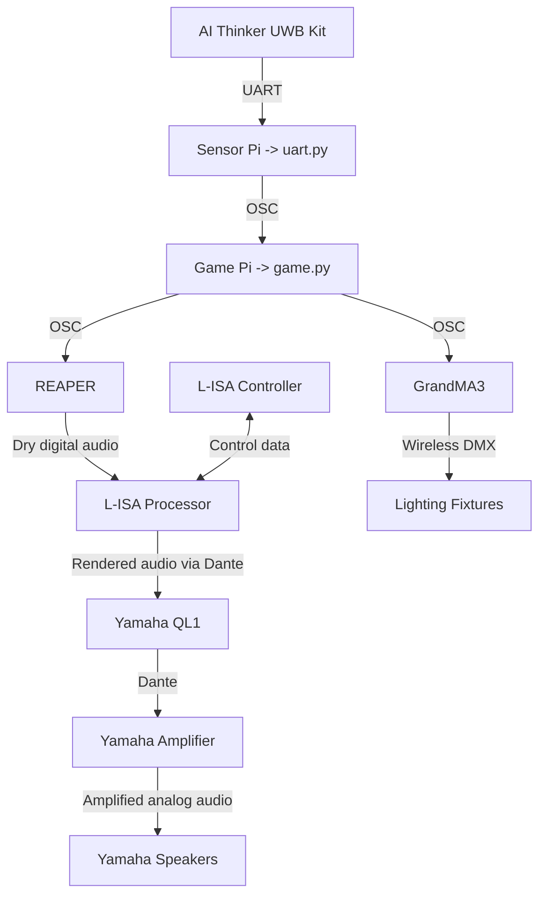

# MVP README


## Table of Contents
* [1. Repository Structure](#1-Repository-Structure-(MVP/))
    * [1.1. assets/ ](#11-assets)
    * [1.2. docs/ ](#12-docs)
    * [1.3. game/ ](#13-game)
    * [1.4. module_config-files/ ](#14-module_config-files)
    * [1.5. uart/ ](#15-uart)
    * [1.6. reascripts/ ](#16-reascripts)
    * [1.7. README.md ](#17-READMEmd)
* [2. Project Overview](#2-project-overview)
* [3. Core System Architecture](#3-Core-System-Architecture)


## 1. Repository Structure (MVP/)

```
.
├── MVP/ 
    ├── assets/        # assets used in MVP/ dir
        ├── tracks/                    # tracks used in REAPER (for my team's cues)
        ├── Project Phantom.backup_2026.07.24_13.56.16UTC.show           # GrandMA3 onPC Showfile
        ├── Project_Phantom_Lisa.lisa            # L-ISA Controler file
        └── Project_Phantom_Reaper.rpp            # REAPER file
    ├── docs/
        ├── assets/                    # assets used in documentation
        ├── architecture.md            # system architecture overview
        ├── calibration.md             # uwb anchor calibration guide
        ├── game_flow-logic.md         # explaination of python scripts' logic/flow
        ├── hardware_setup.md          # guide on phyiscal set-up of game
        ├── osc_reference.md           # guide to osc implementation
        ├── setup_and_run.md           # guide to run game.py
        ├── software_setup.md          # rpi prep and software related
        ├── troubleshooting.md         # common issues and its solution
        └── uwb_configuration.md       # BU03 board pinout
    ├── game/          # scripts for game pi/laptop
        ├── assets/                    # assets used in game scripts
        ├── constants.py               # shared constants
        ├── game_manager.py            # main script managing game states, flows, win/loss, zone updates
        ├── game.py                    # main entry point
        ├── kalman.py                  # Smooths tag position data using a Kalman filter
        ├── level_config.py            # level specefic settings
        ├── osc_handler.py             # recivies OSC data from uart Pi to update tag position
        ├── osc_sender.py              # sends OSC cues to grandMA3 and REAPER
        ├── shared_state.py            # shared runtime states
        ├── trilateration.py           # calculates 2D tag position from anchor distance data
        ├── tutorial.py                # tutorial/instructions window 
        ├── viewer.py                  # main game display using Tkinter and Matplotlib
        └── zones.py                   # zone configs and behaviour functions
    ├── module_config-files
        ├── check_uart.sh              # confirms /dev/serial0 mapping
        ├── bu03_detect.py             # UART smoke test
        ├── bu03_multi_config.py       # set ID/role per board
        ├── bu03_inspect.py            # read back saved config
        └── viewer_calibrate.py        # per-anchor offset measurement
    ├── reascripts/
        ├── mute-tracks11-14.lua       # custom script to mute tracks 11-14
        ├── set-repeat.lua             # custom script to set repeat so 
        ├── siera-station-1-completion.lua             # custom script to trigger the end sequence on Reaper
        ├── siera-station-1-intro.lua             # custom script to trigger the intro sequence on Reaper
    ├── uart/
        ├── 4-tag.txt                   # example output of uart.py when checking for live data of 4 tags to "diagnose"
        ├── 5-tag.txt                   # example output of uart.py when checking for live data of 5 tags to "diagnose"
        └── uart-diagnostic.py          # uart.py but with an additional diagnostic feasutre to record down in csv live data
    └── README.md                       # the file oyu are reading now
```

### 1.1. assets/
Contains:
- REAPER File
- L-ISA Controller File
- GrandMA3 Showfile


### 1.2. docs/
| **Documentation**    | **Purpose**                           |
|----------------------|---------------------------------------|
| `architecture.md`      | Explain Software pipeline             |
| `calibration.md`       | Anchor layout and calibration         |
| `game_logic.md`        | Explain game itself                   |
| `hardware_setup.md`    | Hardware setup utilised               |
| `osc_reference.md`     | All OSC traffic                       |
| `setup_and_run     `   | A quick start guide to run game       |
| `software_setup.md`    | Software configuration                |
| `troubleshooting.md`   | Some possible troubles and what to do |
| `uwb_configuration.md` | Configuration workflow                |


### 1.3. game/
Within this dir, there are the refactorised code of the game.py python script

| **Script** | **Purpose** |
|---|---|
| `game.py` | Main entry point; initialises the game, OSC server, state, and UI. |
| `constants.py` | Stores game configuration, zones, anchors, states, and OSC settings. |
| `shared_state.py` | Stores shared runtime data for tags and game states. |
| `game_manager.py` | Manages game flow, tutorial, phases, win/loss, and resets. |
| `viewer.py` | Displays the game map, zones, tags, HUD, and Game Master controls. |
| `tutorial.py` | Provides the lobby and Tutorial/Instant Play selection. |
| `zones.py` | Handles zone occupancy, expansion, shrinking, capture, and danger zones. |
| `osc_handler.py` | Receives UWB distance data and updates calculated tag positions. |
| `osc_sender.py` | Sends game, lighting, and audio cues to grandMA3 and REAPER via OSC. |
| `trilateration.py` | Calculates 2D tag positions from UWB anchor distances. |
| `kalman.py` | Filters calculated tag positions to reduce tracking noise. |


### 1.4 module_config-files/
These are the scripts used during deployment and setup of anchors and tags.

| **Script**           | **Purpose**                             |
|----------------------|-----------------------------------------|
| `bu03_detect.py`       | Detect connected module                 |
| `bu03_inspect.py`      | Read module information                 |
| `bu03_multi_config.py` | Configure connected module              |
| `check_uart.sh`        | Verify UART communication               |
| `viewer_calibrate.py`  | Calibration and coordinate verification |


### 1.5 uart/
In this dir, you can find the python script that run on the uart Pi, that is responsible of sending tag position data via OSC to the game Pi.


### 1.6 reascripts/
In this dir, you can find the *reascripts* (`lua`) used to create custom commands in Reaper.


### 1.7 README.md
This is the current file that you are reading. An overview of this checkpoint of the project.


## 2. Project Overview

An interactive multiplayer game that uses **Ai-Thinker BU03-Kit UWB modules (DW3000 + STM32F103)** for real-time player tracking.

The system consists of:
- 6 Anchors (BU03-Kit UWB modules)
- 2 Tags (BU03-Kit UWB modules)
- Sensor Pi (UWB data acquisition)
- Game Pi/Laptop (game engine & visualisation)
- Reaper (multi-track digital audio workstation)
- L-ISA Processor & Controller (surround sound processing)
- GrandMA3 onPC (lighting control)

In the game, players must occupy safe zones while avoiding moving danger zones. Visualised through `game.py` running on the Game Pi.


## 3. Core System Architecture



## Credits
Built around the Ai-Thinker BU03-Kit (DW3000 + STM32F103). Hardware datasheet and AT command reference: https://en.ai-thinker.com/pro_view-158.html.

Core Electronics BU03 Spatial Tracking Guide https://core-electronics.com.au/guides/diy-2d-and-3d-spatial-tracking-with-ultra-wideband-arduino-and-pico-guide/.
