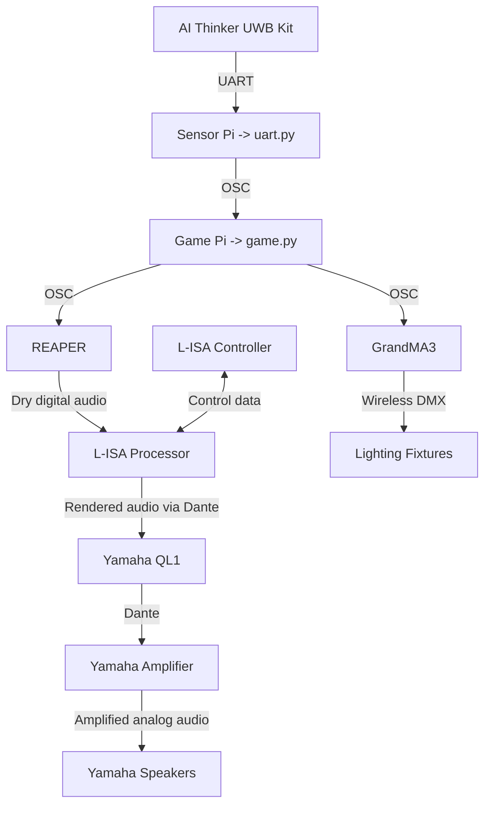
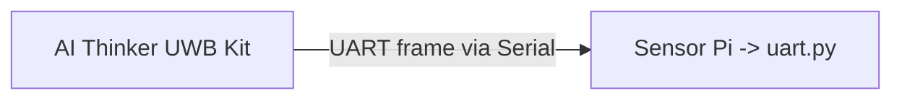
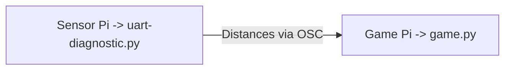
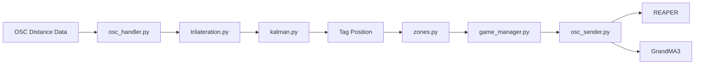
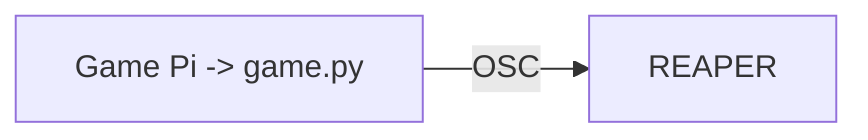
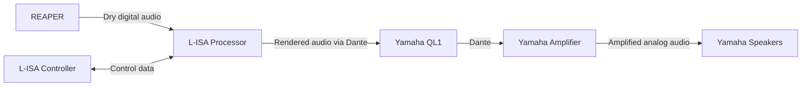
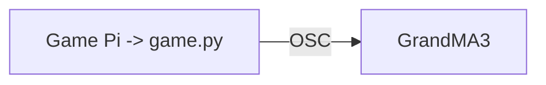

# System Architecure Documentation
In this document, you will find explaination of the software pipeline in this project.


## 1. Overarching Data Flow



## 2. UWB Data Pipeline
### UART Frame via Serial

When `uart.py` is running on the **Senor Pi**, it is actively reading **raw UART frames** from the **BU03-Kit** via the serial port.


### Distances via OSC  

`uart.py` parses UART data into 12 distances (m) per tag *(x and y distance per anchor from tag)*, applies per-anchor calibration offsets, then **broadcasts each frame over OSC** to the **Game Pi** running `game.py`.


## 3. Game Software Processing
Once the distance data reaches the **Game Pi**, it passes through several software modules responsible for converting the UWB measurements into gameplay actions.



`osc_handler.py` receives the UWB distance data and passes the measurements through the positioning process.

`trilateration.py` calculates the tag's 2D position relative to the configured anchor positions.

`kalman.py` filters the calculated position to reduce tracking noise and produce a more stable position.

`zones.py` compares the tag positions against the configured game zones and manages zone occupancy, expansion, shrinking, capture, and danger-zone movement.

`game_manager.py` uses these zone states to manage the overall game flow, including the tutorial, gameplay phases, game-over conditions, and game completion.

Finally, `osc_sender.py` sends the required OSC commands to **REAPER** and **grandMA3** to trigger the corresponding audio and lighting cues.


### Game Software Modules
The game software is separated into modules so that positioning, gameplay, visualisation, and external OSC control can be managed independently.

| Module | Responsibility |
|---|---|
| `game.py` | Main application entry point and initialisation. |
| `constants.py` | Stores anchors, zones, game states, and system configuration. |
| `shared_state.py` | Maintains shared tag and game runtime data. |
| `osc_handler.py` | Receives UWB distance measurements through OSC. |
| `trilateration.py` | Calculates 2D tag positions from anchor distances. |
| `kalman.py` | Filters tag positions to reduce tracking noise. |
| `zones.py` | Handles zone detection, expansion, shrinking, capture, and danger-zone movement. |
| `game_manager.py` | Controls tutorial, gameplay phases, win/loss, and game state transitions. |
| `viewer.py` | Displays the game environment, HUD, tags, zones, and Game Master controls. |
| `tutorial.py` | Provides the lobby and tutorial/instant-play selection. |
| `osc_sender.py` | Sends gameplay cues to REAPER and grandMA3. |


### Zone Occupancy Processing

**Zone occupancy is determined collectively across all active UWB tags**.

When the first tag enters a safe zone, the zone becomes occupied and begins expanding. If additional tags enter the same zone, it remains occupied without repeatedly triggering the same zone-enter event.

The zone ***only becomes unoccupied when the final tag leaves***. This prevents a zone from shrinking while another player is still standing inside it.


## 4. External Show-Control Pipeline
### Commands Triggering 'REAPER' and 'GrandMA3' via OSC

Through `game.py` **game logic**, it would determine whether to trigger certain sequences, by **sending an OSC command to REAPER & GrandMA3** to run a certain audio track. 

For example, when a tag is within a zone, it **triggers a series of cues**, by **sending an osc command to REAPER**.

```python
osc_tx_reaper.send_message("/action/40958", 1)  #select track 20
osc_tx_reaper.send_message("/action/40731", 1)  #selected track toggle unmute
```
*^ this selects track 20 and unmutes it on **REAPER**.*

Similarly, when a tag is within a zone, it **triggers a cue for lights** by **sending an osc command to GrandMA3**

```python
osc_tx_gma3.send_message("/gma3/cmd", f"Goto Cue {cue} Sequence 2")
```
*^ this triggers cue number x in Sequence 2 on **GrandMA3**.*


## 5. Audio Signal Flow From REAPER to Speakers

- When OSC is sent to **REAPER**, it **plays the sound tracks**.  
*(REAPER is where all the music, sound effects, and other audio tracks are stored and played.)*
- **L-ISA Processor "places" the sounds around the room**.  
*(The audio is sent to the L-ISA Processor, which controls where each sound appears to come from, such as the left, right, front, back, or around the audience.)*
- **L-ISA Controller controls the sound placement**.  
*(The L-ISA Controller is the control screen used by the operator. It tells the Processor where sounds should be placed and how they should move.)*
- The **Yamaha QL1** recieves the audo from **L-ISA Processor** and **routes it to the amplifiers**.  
*(The processed audio travels digitally to the Yamaha QL1 mixing console. The console controls the final volume levels and sends each sound to the correct speaker channel.)*
- The **amplifier gives the signals enough power**  
*(The audio is sent to the Yamaha amplifier, which increases the strength of the signals so they can power the speakers.)*
- The **speakers play the sound**  
*(Finally, the amplified signals reach the Yamaha speakers and are turned into the sound heard by the audience.)*


## 6. Lighting Signal Flow 

After each Lighting cue from OSC, a cue on GrandMA is triggered, and it would send a lighting control signal to the lighting fixtures via wireless DMX. 