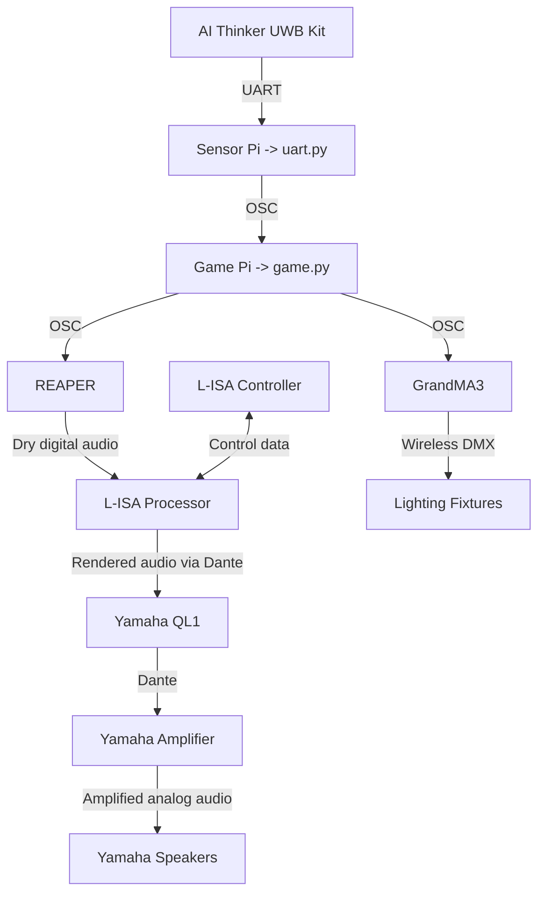
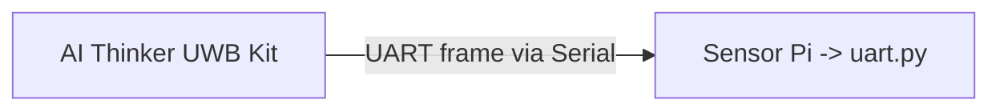
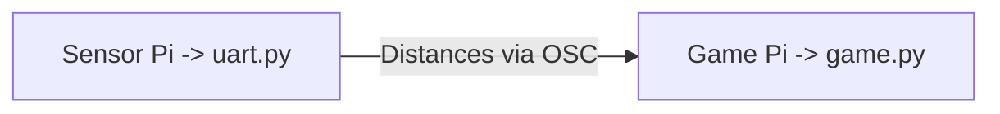
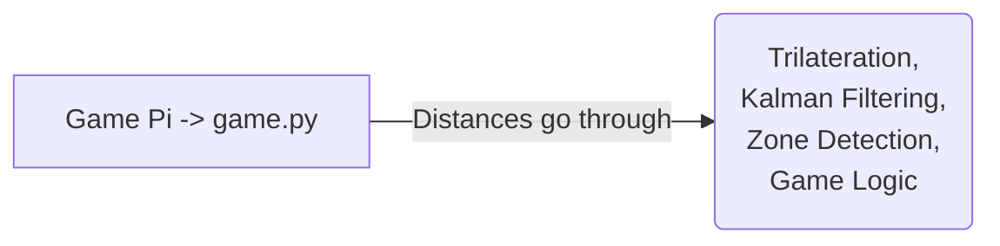
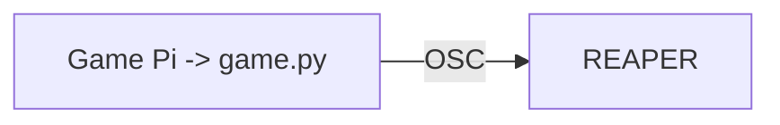
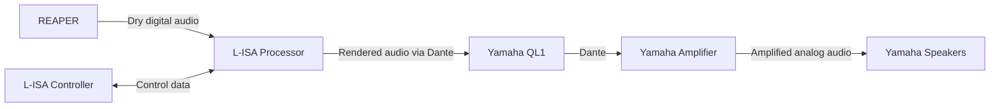
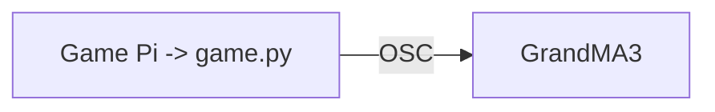

# System Architecure Documentation
In this document, you will find explaination of the software pipeline in this project.


## Overarching Data Flow



## UART Frame via Serial

When `uart.py` is running on the **Senor Pi**, it is actively reading **raw UART frames** from the **BU03-Kit** via the serial port.


## Distances via OSC  

`uart.py` parses UART data into 12 distances (m) per tag *(x and y distance per anchor from tag)*, applies per-anchor calibration offsets, then **broadcasts each frame over OSC** to the **Game Pi** running `game.py`.


## Processes That Distance Values Go Through

Each frame, `game.py` is **trilaterating the distances** to determine the tag's position, **relative to the anchor positions**. 

These distance values are also passed through a **Kalman Filtering** process, which basically creates a **prediction of the next likely position** of tag based on its velocity. 

While tag's positions are being processed, `game.py` is also constantly **checking whether positon of tag coresponds to the zones posititons**. - this would then **trigger the game logics**, be it to increase size of zone, or to trigger an end game sequence.


## Commands Triggering 'REAPER' and 'GrandMA3' via OSC

Through `game.py` **game logic**, it would determine whether to trigger certain sequences, by **sending an OSC command to REAPER & GrandMA3** to run a certain audio track. 

For example, when a tag is within a zone, it **triggers a series of cues**, by **sending an osc command to REAPER**.

```python
osc_tx_reaper.send_message("/action/40958", 1)  #select track 20
osc_tx_reaper.send_message("/action/40731", 1)  #selected track toggle unmute
```
*^ this selects track 20 and unmutes it on **REAPER**.*

Similarly, when a tag is within a zone, it **triggers a cue for lights** by **sending an osc command to GrandMA3**

```python
osc_tx_gma3.send_message("/gma3/cmd", f"Goto Cue {cue} Sequence 2")
```
*^ this triggers cue number x in Sequence 2 on **GrandMA3**.*


## Audio Signal Flow From REAPER to Speakers

- When OSC is sent to **REAPER**, it **plays the sound tracks**.  
*(REAPER is where all the music, sound effects, and other audio tracks are stored and played.)*
- **L-ISA Processor "places" the sounds around the room**.  
*(The audio is sent to the L-ISA Processor, which controls where each sound appears to come from, such as the left, right, front, back, or around the audience.)*
- **L-ISA Controller controls the sound placement**.  
*(The L-ISA Controller is the control screen used by the operator. It tells the Processor where sounds should be placed and how they should move.)*
- The **Yamaha QL1** recieves the audo from **L-ISA Processor** and **routes it to the amplifiers**.  
*(The processed audio travels digitally to the Yamaha QL1 mixing console. The console controls the final volume levels and sends each sound to the correct speaker channel.)*
- The **amplifier gives the signals enough power**  
*(The audio is sent to the Yamaha amplifier, which increases the strength of the signals so they can power the speakers.)*
- The **speakers play the sound**  
*(Finally, the amplified signals reach the Yamaha speakers and are turned into the sound heard by the audience.)*


## Lighting Signal Flow 

After each Lighting cue from OSC, a cue on GrandMA is triggered, and it would send a lighting control signal to the lighting fixtures via wireless DMX. 