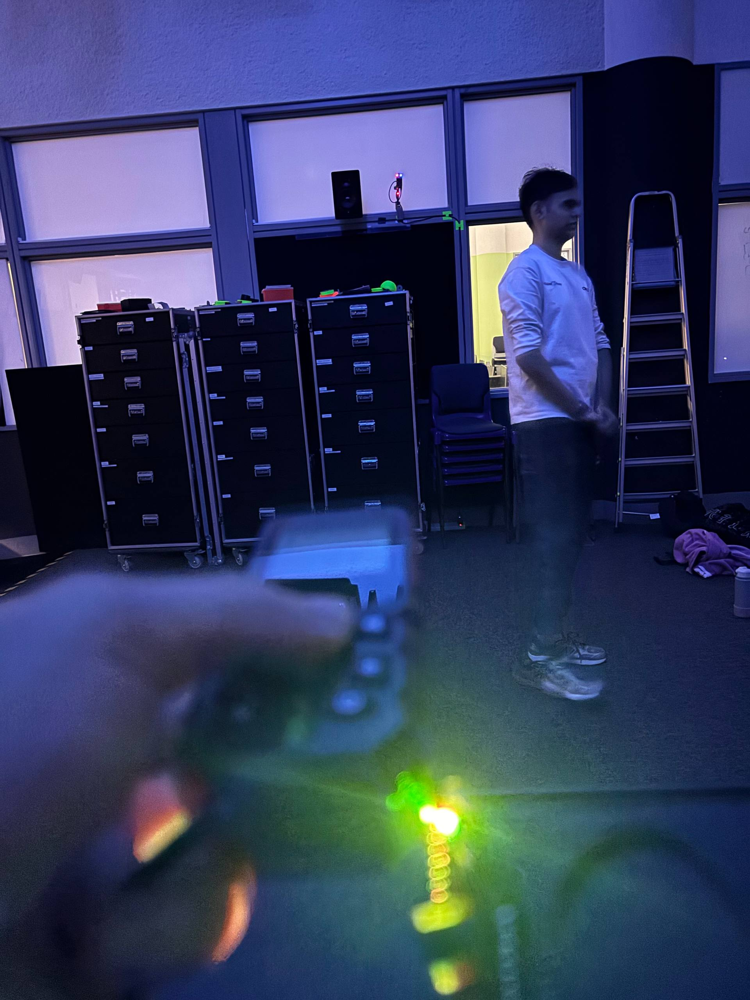
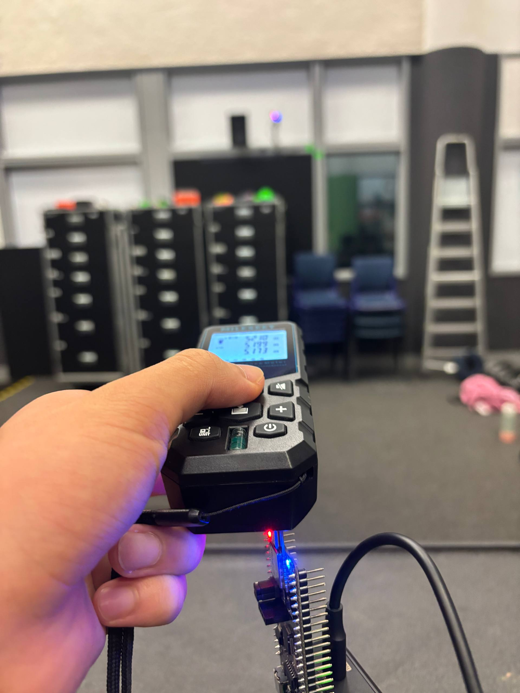
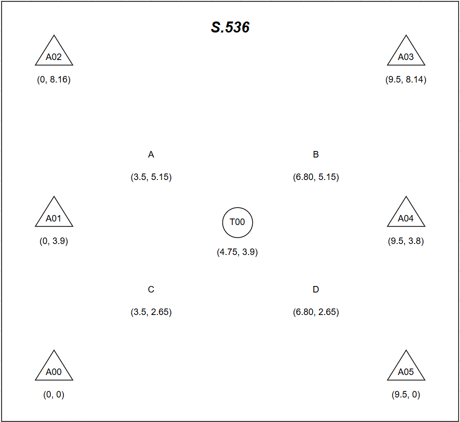

# System Calibration Documentation
**The following are the steps to follow for calibrating the tags and anchor**

Procedure (do this **once** for each anchor):
  1) Place ONE tag at a measured, known distance from one anchor.
     E.g., 1.000 m from anchor 0, with a tape measure to confirm.
  2) The other tags should be powered OFF (so we don't have to worry
     about which slot they're in).
  3) Run `viewer_calibrate.py` , telling it which anchor and the true distance.
  4) Hold the tag still for the capture duration.
  5) The script, `viewer_calibrate.py` reports the offset to add to that anchor's distances.

Repeat for each anchor. Then put the offsets in your `bu03_multi_config.py`.

Run:
    python3 `viewer_calibrate.py` --anchor 0 --true-distance 1.5 --seconds 20
"""

## How the calibrations was taken visually
1. We set up the anchors across the room and put a tag in the middle of the room and using the laser distance meter, measured the distance from the tag in the center of the room to the anchors position in the room 

## Measurements

3. Offsets and distances

      | Point | Distance (m) | Offset | Remarks |
      |------|-------------:|-------:|---------|
      | A0 | 6.0 | -0.749 | A0 offset |
      | A1 | 4.8 | -0.055 | A1 offset |
      | A2 | 6.6 | 0.021 | A2 offset |
      | A3 | 6.6 | 0.025 | A3 offset |
      | A4 | 4.8 | -0.005 | A4 offset |
      | A5 | 6.2 | +0.233 | A5 offset |

