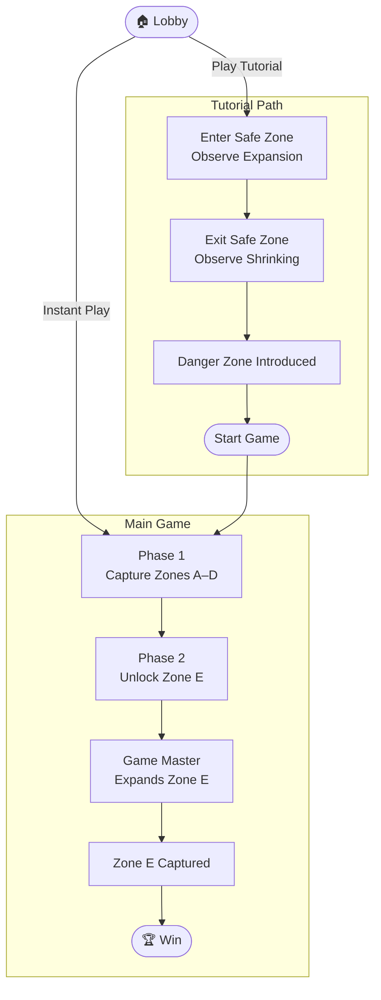
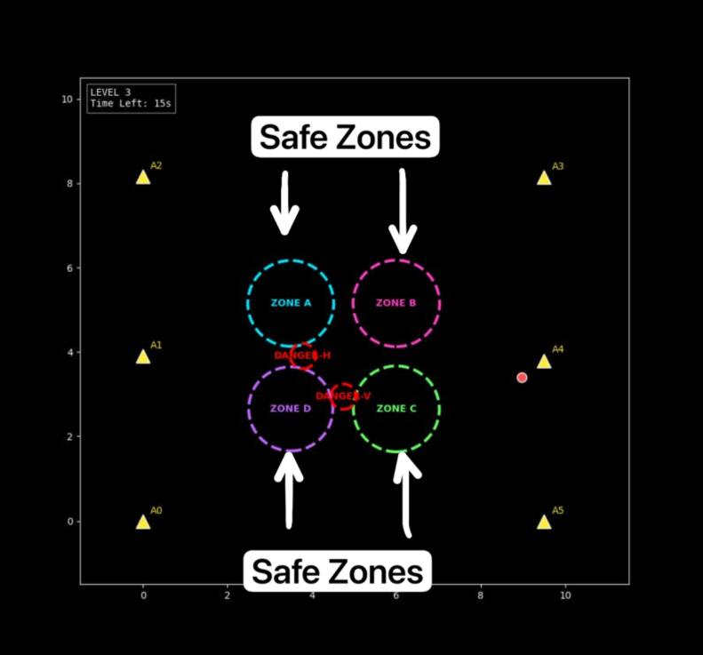
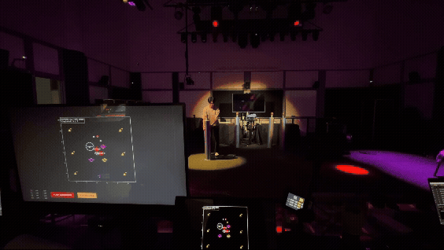
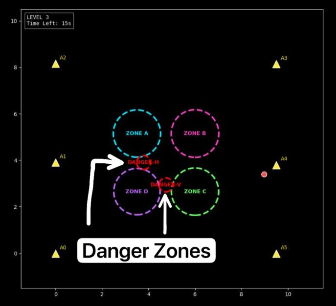
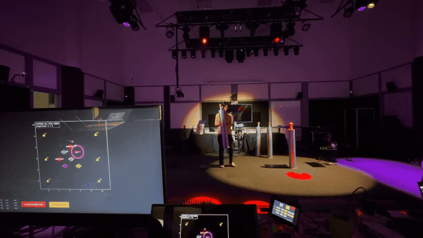
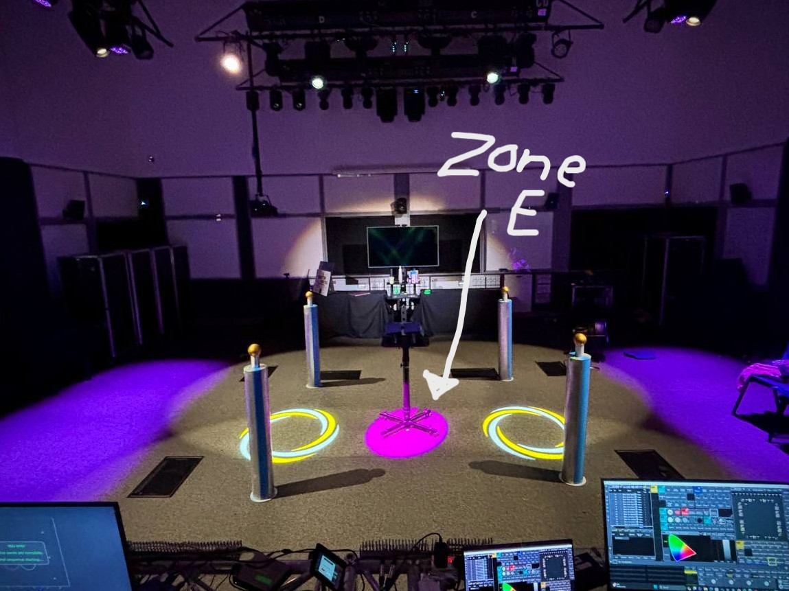
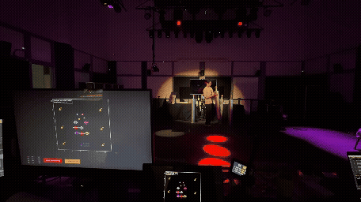

# Game Flow Documentation

## Overview:

The UWB Game is an interactive location-based experience that uses Ultra-Wideband (UWB) positioning to track players in real time as they navigate a physical play area. Players interact with dynamic safe and danger zones, while their movements also trigger lighting and audio effects through Open Sound Control (OSC).

The game follows a simple but structured progression. Players begin in the lobby, where they can either complete a short tutorial or start the game immediately. The main game consists of two phases: players first work together to capture four player-controlled safe zones (Zones A–D), before unlocking a final manually controlled objective, Zone E, to complete the experience.

The diagram below illustrates the overall gameplay flow from the lobby, through the tutorial and gameplay phases, to the game's completion.

# Game Logic Documentation

<!--## Game Master Controls-->
## Overview

This section describes the core gameplay logic implemented. The game operates as a state-driven system in which player interactions, zone behaviour, and game progression are controlled through a series of predefined rules.

During gameplay, players collaboratively capture Safe Zones (Zones A–D) by positioning the UWB-enabled pillars within each zone until it is fully captured. Once all four Safe Zones have been captured, the game transitions to a second phase where the Game Master manually triggers the expansion of the final objective, Zone E. Throughout the game, moving Danger Zones remain active as environmental hazards, while game state transitions such as game over, victory, and retry are managed by the Game Manager.

The following sections describe the individual gameplay mechanics, state transitions, and zone behaviours that together define the game's logic.
## Game Elements
### Safe Zone
The game contains four player-controlled Safe Zones (Zones A–D). At the start of the game, these zones are hidden from the players. To discover and capture a zone, players move UWB-enabled pillars around the play area until a pillar enters a Safe Zone.

In ViewerApp, it should look like the picture below.

Physically, the picture below is what the players should see.

#### Behavior
Before a Safe Zone has been captured:
- Safe Zones are hidden at the start of the game.
- When a UWB-enabled pillar enters a Safe Zone, the zone lights up and begins expanding.
- Removing the pillar before the zone is fully captured causes the zone to gradually shrink.

### Danger Zone
Danger Zones are moving hazards that remain active throughout gameplay. Two Danger Zones move continuously across the play area, one horizontally and one vertically, creating dynamic obstacles that players must navigate around while completing objectives.

In ViewerApp, it should look like the picture below.

Physically, the picture below is what the players should see.

#### Behavior

- Two Danger Zones move continuously within predefined arena boundaries.
- Each Danger Zone reverses direction when it reaches the edge of its movement area.
- Danger Zones remain active throughout the game until the game ends.
- A Game Master can manually trigger a danger-zone clash to initiate the game over sequence.

If a player enters a Danger Zone:
- Game immediately ends.

Their movement increases the challenge by limiting safe paths between Safe Zones.

### Zone E

Zone E serves as the final objective of the game and becomes available only after Safe Zones A–D have been successfully captured.

Unlike the other Safe Zones, Zone E is not captured through player occupancy. Instead, its expansion is initiated manually by the Game Master. Once activated, Zone E expands automatically until it reaches its maximum size, completing the game and triggering the victory sequence.

In ViewerApp, it should look like the picture below.

Physically, the picture below is what the players should see.

#### Behaviour

- Hidden during Phase 1.
- Activated after Zones A–D have been captured.
- Expansion is triggered manually by the Game Master.
- Automatically expands until its maximum radius.
- Capturing Zone E transitions the game to the victory state.

## Player Equipment

The game consists of 4 pillars. Players carry and position the pillar throughout the play area to interact with the virtual game environment.

The pillar is used to discover and capture Safe Zones by placing it within their boundaries. Players are encouraged to hold ad carry the pillars by its body to ensure smooth gameplay.

The image below shows a player carrying the pillar during gameplay.

## Win Condition
Players win by successfully capturing all game objectives.

To achieve victory, players must:

- Capture Safe Zones A–D.
- Complete the final objective by capturing Zone E.

Once Zone E has been captured:

- The victory sequence is triggered.
- Final lighting and audio cues are played.
- The game transitions to the **Win** state.

## Lose Conditions

The game enters the **Game Over** state when the Game Master triggers a danger-zone clash.

Once the game is over:

- Gameplay immediately stops.
- The Game Over lighting and audio cues are triggered.
- Players may restart the game using the **Retry** function.

# Game Master

The Game Master oversees the progression of the game through a dedicated control interface. While players interact with the game by completing objectives, the Game Master is responsible for managing key gameplay events, triggering state transitions, and controlling the overall flow of the experience.

## Controls

The Game Master has access to the following controls during gameplay.

| Control | Description |
|----------|-------------|
| **Expand Zone E** | Activates the final objective after Safe Zones A–D have been captured. |
| **Clash Danger Zone** | Triggers the Game Over sequence when a danger-zone clash occurs. |
| **Retry Game** | Resets the game and returns it to the start of gameplay after a Game Over. |
| **Return to Lobby** | Returns the system to the lobby after the victory sequence has completed. |

The Game Master interface is shown below.

## Audio and Visual Feedback

The game provides immediate feedback through audio and visual effects.

| Event                 | Audio Feedback            | Visual Feedback        |
| --------------------- | ------------------------- | ---------|
| Game Start            | Background audio plays    | All zones are hidden|
| Pillar is place in Safe Zone   | Zone expansion effect | The Safe Zone illuminate and expands, until it reaches the maximum size.|
| Pillar is removed from Safe Zone   | Zone expansion effect stop |The illuminated Safe Zone gradually shrinks.|
| Players enter Danger Zone | Warning followed by Game Over sound | All illuminated zones stop moving|
| Victory                   | Victory sound |All zones stay illuminated.|

This feedback helps players understand what is happening during gameplay without needing to look at technical information.

## Conclusion

This document has outlined the core game logic implemented in the UWB Game MVP, including the overall gameplay flow, game elements, state transitions, win and lose conditions, and the responsibilities of the Game Master. Together, these components define the behaviour of the game and provide a reference for understanding, maintaining, and extending the system.
