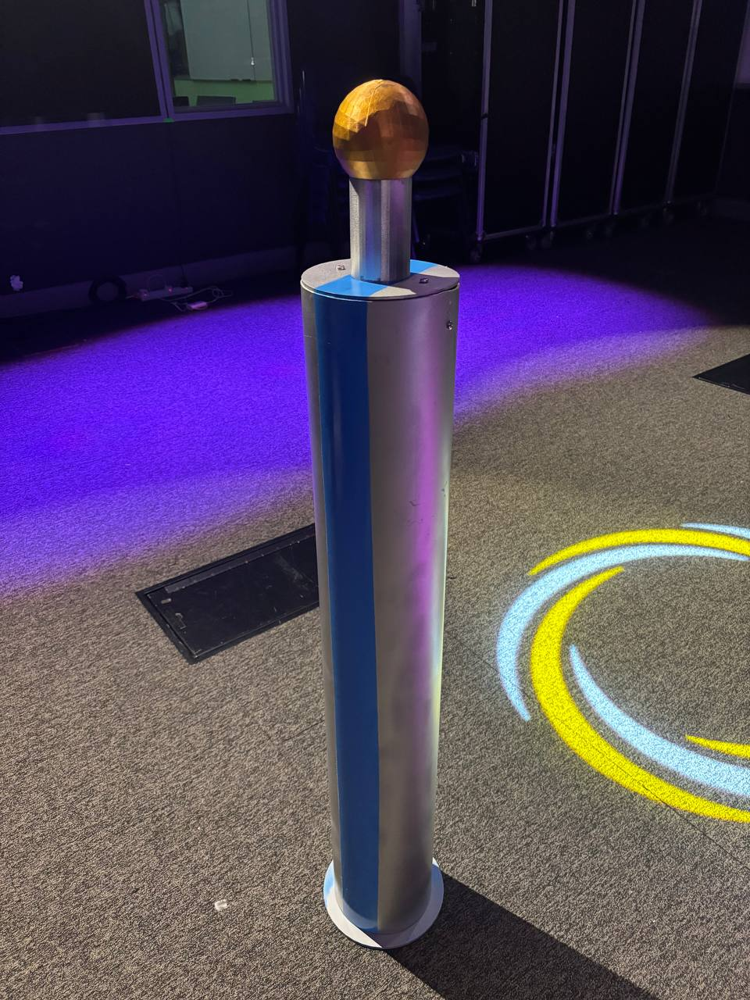
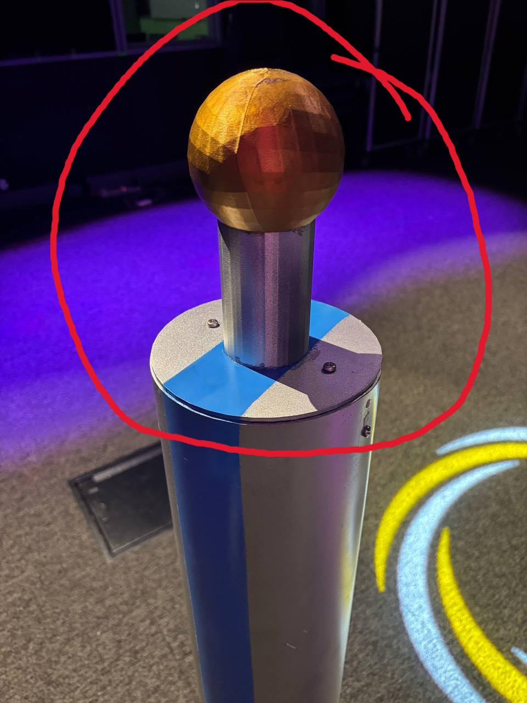
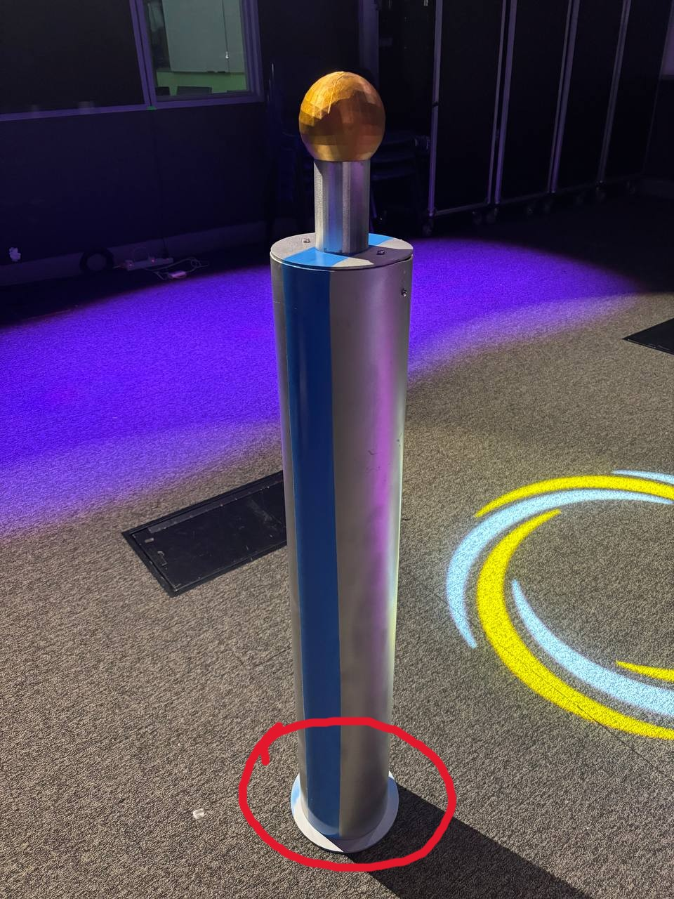
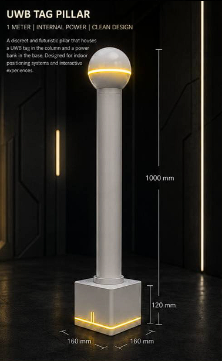
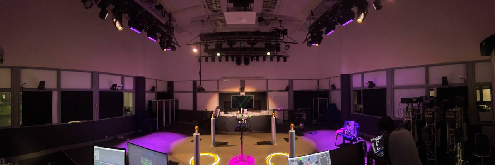
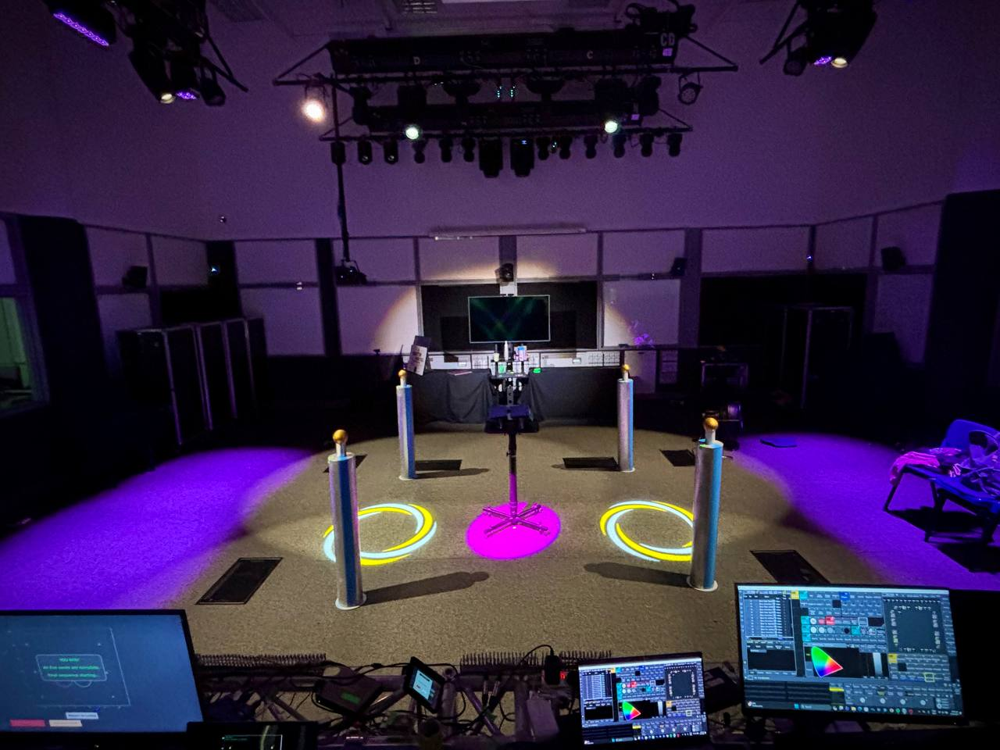

# Hardware Set-up Documentation
UWB Tag Holder
Overview

The UWB tag holder was designed to securely hold the UWB tag during gameplay while allowing it to be positioned at different angles. Instead of designing a holder from scratch, an existing open-source 3D model was used as the base and modified to fit the UWB tag.

Original model used
https://makerworld.com/en/models/2815216-heavy-duty-gravity-phone-mount-articulated-arm?from=search#profileId-3134209

 **2**.**Materials Required**                    
| **Item**                                          | **Purpose**                  |
| ---------------------------------------------- | ------------------------ |
| 3D Printer                                     | Print all required parts |
| PLA/PETG filament                              | Printing material        |
| UWB Tag                                        | Device to be mounted     |
| Elastic band                                   | Keeps the holder closed  |
| Super glue (if required)                       | Secures modified parts   |
| CAD software (Fusion 360/Onshape/Bambu Studio) | Modify the holder design |
**3**
This is just 1 of the 6 finish product that we made.Noted that we did not use every single part of the arm,and clamp and we only used what we though was needed for us.

**4** We made a special holder for the tag to sit on so that it would not drop.Below is a picture of how holder was made for the tag.

**5** 
This are the stl files that we used for the arms, phone holder, screws and the special holder for the tages to sit on

[ARMS](assets/ARMS.3mf)

[PHONE CLAMP](<assets/PHONE CLAMP.3mf>)

[SCREWS](assets/SCREWS.3mf)

[SPECIAL HOLDER](<assets/SPECIAL HOLDER.3mf>)

# Tag Holder Design and Placement

The tag holder was designed to securely house the UWB tag and its power bank while maintaining a clean appearance suitable for the game environment.

---

## Overall Design

The tag holder consists of three main components:

- Pillar body
- Pillar head
- Pillar base

The pillar body contains separate compartments to house both the UWB tag and the power bank.

---

## Pillar Head

* The pillar head was designed to securely hold the UWB tag inside the cylindrical neck section located beneath the decorative gold sphere.

* The power cable from the UWB tag runs through the centre of the pillar and connects to the power bank located in the base.

* Screws were used to fasten the pillar head to the pillar body, providing additional structural strength and durability.

---

## Pillar Base

* The pillar base provides support for the entire structure and houses the power bank.

* It was attached to the PVC pillar body using super glue to create a secure permanent connection.

---

# Materials and Appearance

## Materials Used

The tag holder was constructed using a combination of commercially available and custom-manufactured components.

- PVC pipe was used for the pillar body.
- The pillar head and pillar base were designed and 3D printed.
- Screws were used to secure the pillar head.
- Super glue was used to attach the pillar base.

The overall concept for the pillar was inspired by an initial design generated using ChatGPT, which was later modified to meet the project requirements.

---

## Exterior Design

* To give the pillars a futuristic appearance, two blue stripes were painted along opposite sides of the PVC body, while the decorative sphere was spray-painted gold.

* The spray paint and screws used during assembly are shown below.

* The colour scheme was inspired by another concept generated using ChatGPT, which was further refined for the final design.

---

# Final Implementation

The completed pillars were installed around the game arena, providing both structural support for the UWB tags and an improved visual appearance that complemented the game environment.

