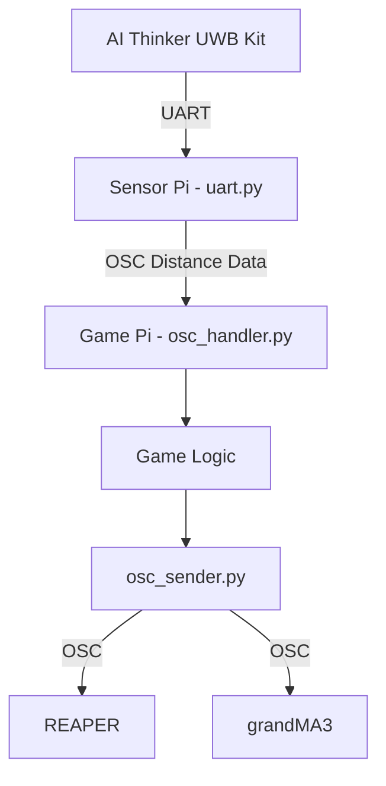
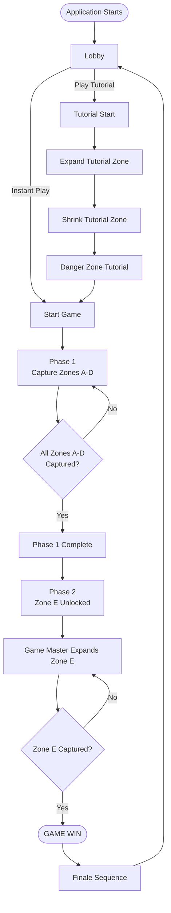

# OSC References Documentation
This document describes the OSC commands received and transmitted by the UWB game software and **explains how each command corresponds to an action within the game**.

OSC reception is primarily handled by `osc_handler.py`, while outgoing gameplay cues to REAPER and grandMA3 are handled by `osc_sender.py`.


## 1. Communication Flow


The OSC communication layer serves two purposes:

1. Transmitting UWB distance measurements from the **Sensor Pi** to the **Game Pi**.

2. Triggering audio and media events from the **Game Pi** to **REAPER** and **grandMA3**.
---

### Sensor Pi -> Game Pi
The `uart-diagnostic`/`uart.py` script reads UART data from the AI Thinker BU03 UWB receiver and forwards the processed distance measurements to the Game Pi via OSC.

| **OSC Address**   | **Arguments**    | **Description**    | **Trigger**        |
|-------------------|------------------|--------------------|--------------------|
| `/distances`      | `tag_id(int)` `d0...d7(float)`   |Transmits the latest distance measurements between a tracked tag and all anchors.|Sent whenever a complete UWB measurement frame is received from the BU03 receiver.

> **Note:** The current UART implementation does not receive a confirmed hardware tag identifier from the BU03 frame. Tag assignment is handled by the Sensor Pi before the OSC `/distances` message is transmitted.

---

### Receiver Behaviour
The Game Pi:
1. Receives the distance measurements.
2. Performs trilateration.
3. Calculates the player's position.
4. Updates the game state.

---

### Game Pi -> GrandMA3 & REAPER
The game communicates with two external systems:

| System | Purpose |
|---|---|
| REAPER | Lobby music, tutorial audio, gameplay audio, zone audio layers, game-over audio, phase-completion audio, and finale audio |
| grandMA3 | Lobby lighting, tutorial lighting, safe-zone lighting, danger-zone lighting, gameplay states, game-over, and finale lighting |

OSC messages are sent from:
```text
MVP/game/osc_sender.py
```

Network addresses and ports are configured in:
```text
MVP/game/constants.py
```


---
## 2. OSC Destinations
| Destination | OSC Client | Address Format | Purpose |
|---|---|---|---|
| REAPER | `osc_tx_reaper` | `/action/<command_id>` | Executes REAPER action commands |
| grandMA3 | `osc_tx_gma3` | `/gma3/cmd` | Executes grandMA3 command-line instructions |


### REAPER message format
```python
osc_tx_reaper.send_message("/action/1007", 1)  # Play Cue
```
The OSC address contains the **REAPER action ID**. The value `1` triggers the action.


### grandMA3 message format
```python
osc_tx_gma3.send_message("/gma3/cmd", "Go Macro 2") # Triggers Macro 2 on GrandMA3
```
The OSC address remains `/gma3/cmd`, while the **OSC value contains the grandMA3 command**.


---
## 3. Game Flow Overview



---
## 4. Lobby & Tutorial OSC
### 4.1 Lobby Start
#### Python function
```python
send_zone_enter()
```
#### REAPER commands
| Order | OSC Address | Action | Game Result |
|---:|---|---|---|
| 1 | `_RS0a8bd5995464dc985213e2e1071132a46345050e` | Custom script that mute tracks 11-14 | make it such that no zone track will be heard |
| 2 | `/action/41761` | jump to region 1 | Jumps to region 1 |
| 3 | `/action/43102` | set loop points to region | start to loop the region of which zone tracks are present |
| 4 | `/action/1007` | Play | Starts playback |

#### grandMA3 commands
| Order | Command | Purpose |
|---:|---|---|
| 1 | `Go Macro 1` | Triggers the Macro 1 in GrandMA which in turn triggeres a series of sequences |

**Game trigger:**
Called when the application enters the lobby.  
**Purpose:**
Initialises the lighting and audio environment for players waiting to begin the experience.


### 4.2 Tutorial Start
#### Python function
```python
send_start_tutorial()
```
#### REAPER commands
| Order | OSC Address | Action | Game Result |
|---:|---|---|---|
| 1 | `_RS4cb981b7c961f3b84673b9007ab7caa7bb13a182` | Set Loop Repeat on REAPER | BGM is running on loop |
| 2 | `/action/40168` | Jump to Marker 8 | start to hear track on marker 8 |
| 3 | `/action/40944` | Select track 8 | select track 8 |
| 4 | `/action/40731` | Selected track unmute | start to hear BGM in region 4 |
| 5 | `/action/1007` | Play | Starts playback |

#### grandMA3 commands
| Order | Command | Purpose |
|---:|---|---|
| 1 | `Go Macro 2` | Triggers the Macro 2 in GrandMA which in turn triggeres a series of sequences |

**Game trigger:**
Called when the player selects PLAY TUTORIAL from the lobby.  
**Purpose:**
Transitions REAPER and grandMA3 from the lobby state into the tutorial state.


### 4.3 Tutorial Danger Zone
#### Python function
```python
send_tutorial_danger_zone()
```
#### REAPER commands
| Order | OSC Address | Action | Game Result |
|---:|---|---|---|
| 1 | `_RS4cb981b7c961f3b84673b9007ab7caa7bb13a182` | Set Loop Repeat on REAPER | BGM is running on loop |
| 2 | `/action/40168` | Jump to Marker 8 | start to hear track on marker 8 |
| 3 | `/action/40944` | Select track 8 | select track 8 |
| 4 | `/action/40731` | Selected track unmute | start to hear BGM in region 4 |
| 5 | `/action/1007` | Play | Starts playback |

#### grandMA3 commands
| Order | Command | Purpose |
|---:|---|---|
| 1 | `Go Macro 3` | Triggers the Macro 3 in GrandMA which in turn triggeres a series of sequences |
**Game trigger:**
Called when the tutorial progresses to the danger-zone stage.**Purpose:**
Triggers the lighting state used to demonstrate the danger zone before normal gameplay begins.


---
## 5. Game Start OSC
### 5.1 Starting Game 
#### Python function
```python
send_start_game()
```
#### grandMA3 commands
| Order | Command | Purpose |
|---:|---|---|
| 1 | `Goto Sequence 106 cue 1` | Triggeres cue 106 on GrandMA3 |
**Game trigger:**
Called when the tutorial progresses to the danger-zone stage.**Purpose:**
Triggers the lighting state used to demonstrate the danger zone before normal gameplay begins.


---
## 6. Safe-Zone OSC
### 6.1 Zone Enter Sequences
#### Python function
```python
send_start_game()
```
#### REAPER commands
| Order | OSC Address | Action | Game Result |
|---:|---|---|---|
| 1 | `/action/40949` | Select track 11 | Select the track with zone A track |
| 2 | `/action/40731` | Selected track toggle unmute | Hear the zone track |
#### grandMA3 commands
| Order | Command | Purpose |
|---:|---|---|
| 1 | `Goto Sequence 110 cue 2` | Triggeres cue 1 on GrandMA3 |
**Game trigger:**
Called when the tag enters the zone. 
**Purpose:**
Triggers the lighting and audio cue when tag entres the zone.


### 6.2 Zone Exit Sequences
#### Python function
```python
send_start_game()
```
#### REAPER commands
| Order | OSC Address | Action | Game Result |
|---:|---|---|---|
| 1 | `/action/40949` | Select track 11 | Select the track with zone A track |
| 2 | `/action/40730` | Selected track toggle mute | Don't hear the zone track |
#### grandMA3 commands
| Order | Command | Purpose |
|---:|---|---|
| 1 | `Go- Sequence 110 cue 1` | Triggeres Go- cue 1 on GrandMA3 |
**Game trigger:**
Called when the tag exits the zone. 
**Purpose:**
Triggers the lighting and audio cue when tag exits the zone.


---
## 7. Danger-Zone OSC
#### Python function
```python
send_game_over()
```
#### REAPER commands
| Order | OSC Address | Action | Game Result |
|---:|---|---|---|
| 1 | `/action/40163` | Jump to marker 3 | Hear the game loss BGM |
| 2 | `/action/1007` | Play | Starts playback |
#### grandMA3 commands
| Order | Command | Purpose |
|---:|---|---|
| 1 | `Go Sequence 115` | Triggeres Sequence 115 on MA |
**Game trigger:**
Called when the tag exits the zone. 
**Purpose:**
Triggers the lighting and audio cue when tag exits the zone.


---
## 8. Game Over OSC


---
## 9. Game Win & Finale OSC
