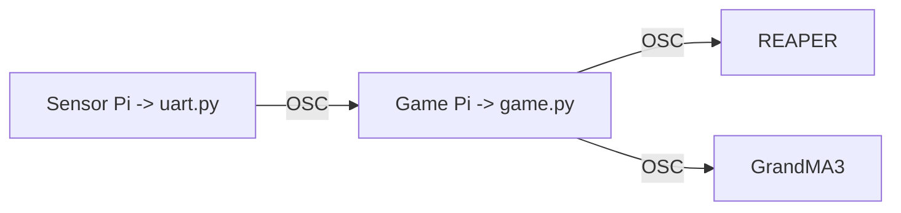
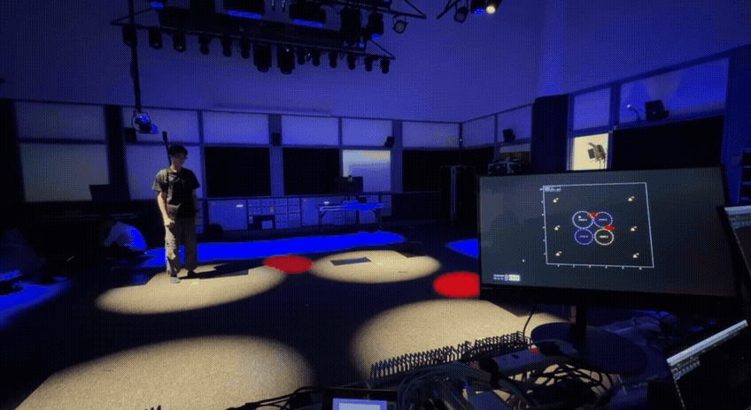
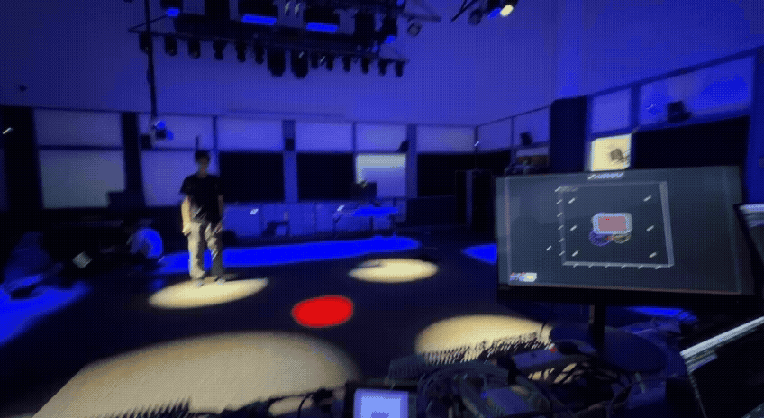

# OSC References Documentation
This document describes the OSC commands **recieved** and **sent** by the `game.py` application and **explains how each command corresponds to an action in the game**.


## 1. Communication Flow

The OSC communication layer serves two purposes:

1. Transmitting UWB distance measurements from the Sensor Pi to the Game Pi.

2. Triggering audio and media events from the Game Pi to the Multiplay media server.

---

### Sensor Pi -> Game Pi
The `uart.py` script reads UART data from the AI Thinker BU03 UWB receiver and forwards the processed distance measurements to the Game Pi via OSC.

| **OSC Address**   | **Arguments**    | **Description**    | **Trigger**        |
|-------------------|------------------|--------------------|--------------------|
| `/distances`      | `tag_id(int)` `d0...d7(float)`   |Transmits the latest distance measurements between a tracked tag and all anchors.|Sent whenever a complete UWB measurement frame is received from the BU03 receiver.

---

### Receiver Behaviour
The Game Pi:
1. Receives the distance measurements.
2. Performs trilateration.
3. Calculates the player's position.
4. Updates the game state.

---

### Game Pi -> GrandMA3 & REAPER
The game communicates with two external systems:
| System | Purpose |
|---     |---      |
| REAPER | Background music, zone audio layers, game-over audio, level-win audio, and finale audio |
| grandMA3 | Tutorial lighting, zone lighting, danger-zone movement, default lighting, and finale lighting |

OSC messages are sent from:

```text
MVP/game/osc_sender.py
```

Network addresses and ports are configured in:

```text
MVP/game/constants.py
```

---

## 2. OSC Destinations
| Destination | OSC Client | Address Format | Purpose |
|---|---|---|---|
| REAPER | `osc_tx_reaper` | `/action/<command_id>` | Executes REAPER action commands |
| grandMA3 | `osc_tx_gma3` | `/gma3/cmd` | Executes grandMA3 command-line instructions |


### REAPER message format
```python
osc_tx_reaper.send_message("/action/1007", 1)  # Play Cue
```
The OSC address contains the **REAPER action ID**. The value `1` triggers the action.


### grandMA3 message format
```python
osc_tx_gma3.send_message("/gma3/cmd", "Goto Cue 1 Sequence 78") # Go+ Cue 1 Sequence 78
```
The OSC address remains `/gma3/cmd`, while the **OSC value contains the grandMA3 command**.

---

## 3. Game Flow Overview

```text
Application starts
        ↓
Start-up lighting and background music
        ↓
Tutorial sequence
        ↓
Player presses Start
        ↓
Game audio begins
        ↓
Players enter and leave safe zones
        ↓
Zone lighting and audio respond
        ↓
Danger zones move
        ↓
Level win or game over
        ↓
After Level 3: default lighting
        ↓
Finale lighting and audio
```

---

## 4. Game Start Sequences
### 4.1 Background Music
#### Python function
```python
send_bgm()
```

#### Game trigger
Called when background music should begin before or during the introductory stage.

#### REAPER commands
| Order | OSC Address | Action | Game Result |
|---:|---|---|---|
| 1 | `/action/41763` | Jump to Region 3 | Moves playback to the background-music region |
| 2 | `/action/43102` | Set loop points to region | Configures Region 3 as the loop |
| 3 | `/action/1007` | Play | Starts playback |

#### Expected result
**REAPER** begins **continuously playing** the introductory background music from Region 3. 

---

### 4.2 Start-Up Lighting Sequence
#### Python function
```python
send_start_sequence()
```

#### Game trigger
Called right **at the start of running `game.py`** script. This is to set the room's lighting to be at its initialised default setting to welcome players in. 

#### grandMA3 commands

| Order | Command | Purpose |
|---:|---|---|
| 1 | `Off Sequence *` | Stops all currently active grandMA3 sequences |
| 2 | `Goto Cue 1 Sequence 78` | Activates the first default-lighting sequence |
| 3 | `Goto Cue 1 Sequence 79` | Activates the second default-lighting sequence |
| 4 | `Goto Cue 1 Sequence 80` | Activates the third default-lighting sequence |
| 5 | `Go Sequence 8` | Starts the tutorial lighting sequence |

#### Expected result
The lighting system is **reset to the required starting state** before the tutorial sequence begins.

---

### 4.3 Tutorial Cue
#### Python function
```python
send_tutorial_cue()
```

#### Game trigger
Called as part of the start sequence and as the player progresses the tutrial stages.

| Destination | Command | Purpose |
|---|---|---|
| grandMA3 | `Go Sequence 8` | Starts the tutorial lighting sequence |

#### Expected result
grandMA3 runs Sequence 8, which contains the lighting programmed for the tutorial.

---

### 4.4 Start Game
#### Python function
```python
send_start_game()
```

#### Game trigger
Called when the player **presses the Start button** after **completing the introduction**.

#### grandMA3 commands
| Order | Command | Purpose |
|---:|---|---|
| 1 | `Off Sequence 78` | Stops one of the pre-game lighting sequences |
| 2 | `Off Sequence 80` | Stops one of the pre-game lighting sequences |

#### REAPER commands
| Order | OSC Address | Action | Game Result |
|---:|---|---|---|
| 1 | `/action/1068` | Toggle repeat | Changes REAPER's repeat state |
| 2 | `/action/41761` | Jump to Region 1 | Moves playback to the main-game audio region |
| 3 | `/action/43102` | Set loop points to region | Sets Region 1 as the playback loop |
| 4 | `/action/40955` | Select Track 17 | Selects the main-game audio track |
| 5 | `/action/40731` | Unmute selected track | Enables the selected game track |
| 6 | `/action/1007` | Play | Starts the main-game audio |

#### Expected result
The **pre-game lighting and soundtrack is stopped** and **REAPER begins playing the main game soundtrack**.

---

## 5. Safe-Zone Audio
Each safe zone is assigned a dedicated REAPER track.

| Zone | REAPER Track | Select Track Action |
|---|---:|---|
| Zone A | Track 20 | `/action/40958` |
| Zone B | Track 21 | `/action/40959` |
| Zone C | Track 22 | `/action/40960` |
| Zone D | Track 23 | `/action/40961` |

### 5.1 Player Enters a Zone
#### Python function
```python
send_zone_enter(tag_id, zone_index)
```

#### Game trigger
Called when a player **tag position enters** into that **safe zone**.

#### Command behaviour
| Zone | Select Track | Audio Action | Result |
|---|---|---|---|
| Zone A | `/action/40958` | `/action/40731` | Select and unmute Track 20 |
| Zone B | `/action/40959` | `/action/40731` | Select and unmute Track 21 |
| Zone C | `/action/40960` | `/action/40731` | Select and unmute Track 22 |
| Zone D | `/action/40961` | `/action/40731` | Select and unmute Track 23 |

#### Expected result
The **audio layer** associated with the occupied zone **becomes audible (unmute)** when **player enters respective zones**.

#### Debug output
```text
[OSC] Sent ENTER Tag=<tag_id> Zone=<zone_name>
```

---

### 5.2 Player Exits a Zone
#### Python function
```python
send_zone_exit(tag_id, zone_index)
```

#### Game trigger
Called when a player **tag position exits** from that **safe zone**.

#### Command behaviour
| Zone | Select Track | Audio Action | Result |
|---|---|---|---|
| Zone A | `/action/40958` | `/action/40730` | Select and mute Track 20 |
| Zone B | `/action/40959` | `/action/40730` | Select and mute Track 21 |
| Zone C | `/action/40960` | `/action/40730` | Select and mute Track 22 |
| Zone D | `/action/40961` | `/action/40730` | Select and mute Track 23 |

#### Expected result
The **audio layer** associated with the zone **is muted** after the player leaves it (exits).

#### Debug output
```text
[OSC] Sent EXIT Tag=<tag_id> Zone=<zone_name>
```

---

## 6. Safe-Zone Lighting Cues
### Python function
```python
send_zone_cue(zone, cue)
```

### Game trigger
Called when the **visual state of a safe zone changes**. This may occur when the **zone expands**, **shrinks**, **reaches a threshold** or **completes an objective**.  

The game uses a **loop to check the actual size** of the zone on the viewer and the **state that it is in** (expanding or shrinking), which then **sends a corresponding cue to grandma**. 
```python
## Code snipet from zones.py

current_cue = zone["current_cue"]

    if direction == "growing":
        # Growing moves toward Cue 1.
        new_cue = max(1, current_cue - 1)

    elif direction == "shrinking":
        # Shrinking moves toward Cue 11.
        new_cue = min(11, current_cue + 1)

    else:
        return

    if new_cue == current_cue:
        return
```

For example:  
Player **enters Zone A**. Loop identifies **Zone A to be at 65%**, it would have **sent grandma cue 4 sequence 2 (70% size)** as the light has to grow to the next size up.  
If player **exits Zone A**, and the **size is 65%**, it reverses the cue being sent and **sends grandma cue 5 sequence 2 (50% size)** as the light has to start shrinking.

### Zone-to-sequence assignment
| Zone | grandMA3 Sequence |
|---|---:|
| Zone A | Sequence 2 |
| Zone B | Sequence 3 |
| Zone C | Sequence 4 |
| Zone D | Sequence 5 |

### Commands
| Zone | Generated command |
|---|---|
| Zone A | `Goto Cue <cue> Sequence 2` |
| Zone B | `Goto Cue <cue> Sequence 3` |
| Zone C | `Goto Cue <cue> Sequence 4` |
| Zone D | `Goto Cue <cue> Sequence 5` |

### Cue meaning
| Cue | Suggested meaning           | Actual GrandMA3 Programming |
|---: |---                          |---                          | 
| 1   | Zone active at maximum size | Spot Fixture at given maximum zoom |
| 2   | Zone active at 90% size     | Spot Fixture at 90% of maximum zoom |
| 3   | Zone active at 80% size     | Spot Fixture at 80% of maximum zoom |
| 4   | Zone active at 70% size     | Spot Fixture at 70% of maximum zoom |
| 5   | Zone active at 60% size     | Spot Fixture at 60% of maximum zoom |
| 6   | Zone active at 50% size     | Spot Fixture at 50% of maximum zoom |
| 7   | Zone active at 40% size     | Spot Fixture at 40% of maximum zoom |
| 8   | Zone active at 30% size     | Spot Fixture at 30% of maximum zoom |
| 9   | Zone active at 20% size     | Spot Fixture at 20% of maximum zoom |
| 10  | Zone active at 10% size     | Spot Fixture at 10% of maximum zoom |
| 11  | Zone active at minimum size | Spot Fixture at given minimum zoom |

#### Debug output
```text
[OSC GMA3] Sent Cue <cue> <zone_name>
```

#### Snippet of Zone Expansion and Shrinking cues in real life


---

## 7. Danger-Zone Movement Lighting
### Python function
```python
send_danger_movement(axis, cue)
```

### Game trigger
Called when the corresponding danger zone hits its boundary and changes direction and moves or when passing the central positon.

When danger zone hits the maximum position, it send the trigger to cue 1 (center) so that the lighting will start moving to center as the zone moves towards it's minimum position. 
```python
## Code snipet from zones.py

DANGER_CUES = {
    "centre": 1,
    "min": 2,
    "max": 3,
}

def initialise_danger_zones():
    x_min, x_max, y_min, y_max = DANGER_BOUNDS

    centre_x = (x_min + x_max) / 2
    centre_y = (y_min + y_max) / 2

    for zone in ZONES:
        if not zone.get("is_danger"):
            continue

        zone["current_osc_cue"] = None

        if zone["axis"] == "horizontal":
            cx, cy = zone["center"]
            zone["center"] = (centre_x, cy)

            vx, vy = zone["velocity"]
            zone["velocity"] = [abs(vx), 0]

            send_danger_target(zone, "max")

        elif zone["axis"] == "vertical":
            cx, cy = zone["center"]
            zone["center"] = (cx, centre_y)

            vx, vy = zone["velocity"]
            zone["velocity"] = [0, abs(vy)]

            send_danger_target(zone, "max")


def send_danger_target(zone, target):
    cue = DANGER_CUES[target]

    # Avoid sending the same cue repeatedly.
    if zone.get("current_osc_cue") == cue:
        return

    zone["current_osc_cue"] = cue
    zone["movement_target"] = target

    print(
        f"[DANGER OSC] {zone['label']} "
        f"-> {target} | Cue {cue}"
    )

    send_danger_movement(
        zone["axis"],
        cue
    )
```

### Axis-to-sequence assignment
| Danger-zone axis | grandMA3 Sequence |
|---               |---                |
| Horizontal       | Sequence 6        |
| Vertical         | Sequence 7        |

### Commands
| Axis       | Generated command           |
|---         |---                          |
| Horizontal | `Goto Sequence 6 Cue <cue>` |
| Vertical   | `Goto Sequence 7 Cue <cue>` |

### Suggested cue map
*both horizontal and vertical zone sequences have the same cue sequence, just different position of lights.*

| Cue | Suggested game state |
|---: |---                   |
| 1   | Center position      |
| 2   | Maximum position     |
| 3   | Minimum position     |

### Invalid axis handling
If an axis other than `horizontal` or `vertical` is supplied, no OSC command is sent.

Example console output:
```text
Unknown danger axis: diagonal
```

#### Snippet of danger zone movement cues in real life (look at the red spot)



---

## 8. Game Over Sequence
### Python function
```python
send_game_over()
```

### Game trigger
Called when the **player loses**, such as **when a danger zone collides** with tag position (player) or **when safe zones shrinks to  minimum size**. 

#### Snippet of danger zone colision in real life (look at the red spot)      


### REAPER commands
| Order | OSC Address | Action | Game Result |
|---:|---|---|---|
| 1 | `/action/40341` | Mute all tracks | Stops normal gameplay audio layers |
| 2 | `/action/40162` | Jump to Marker 2 | Moves playback to the game-over section |
| 3 | `/action/40956` | Select Track 18 | Selects the game-over audio track |
| 4 | `/action/40731` | Unmute selected track | Enables the game-over track |
| 5 | `/action/1007` | Play | Starts the game-over audio |
| 6 | `/action/1068` | Toggle repeat | Changes the repeat state |

### Expected result
**All gameplay audio is muted** and the **dedicated game-over audio is played**.

#### Debug output
```text
[OSC] Sent Game Over
```

---

## 9. Level Win Sequence
### Python function
```python
send_level_win()
```

### Game trigger
Called when the **player successfully completes a level**. This occurs when **all zones are still active** by the end of the countdown timer for that level.

### REAPER commands
| Order | OSC Address | Action | Game Result |
|---:|---|---|---|
| 1 | `/action/40341` | Mute all tracks | Stops normal gameplay audio |
| 2 | `/action/40163` | Jump to Marker 3 | Moves playback to the level-win section |
| 3 | `/action/40957` | Select Track 19 | Selects the win audio track |
| 4 | `/action/40731` | Unmute selected track | Enables the win audio |
| 5 | `/action/1007` | Play | Starts win audio playback |
| 6 | `/action/1068` | Toggle repeat | Changes the repeat state |

### Expected result
The **gameplay audio is muted** and the **level-completion sound is played**.

#### Debug output
```text
[OSC] WIN
```

---

## 10. Pause REAPER
### Python function
```python
send_pause_reaper()
```

| OSC Address | Action |
|---|---|
| `/action/1008` | Pause REAPER playback |

This function is used at various posints **to pause the REAPER cursur** to keep playing indefinitely. such as **after level won/loss sewuences**, or when the **game is completed**. 

---

## 11. End-of-Game Sequence
The end-game sequence consists of two stages:

```text
Level 3 completed
        ↓
Default lighting and win audio
        ↓
Two-second delay
        ↓
Pause REAPER
        ↓
Game manager waits for finale timing
        ↓
Finale lighting and audio
```

### 11.1 Default End Lighting
#### Python function
```python
send_game_end_default_lighting()
```

#### Game trigger
Called immediately after Level 3 is completed.
```python 
## Code snippet taken from game_manager.py

# ---------------------------------------------
# Stage 1: default GrandMA lighting
# ---------------------------------------------
send_game_end_default_lighting()
```

#### grandMA3 commands
| Order | Command | Purpose |
|---:|---|---|
| 1 | `Off Sequence *` | Stops all current lighting sequences |
| 2 | `Goto Cue 1 Sequence 78` | Restores default lighting layer 1 |
| 3 | `Goto Cue 1 Sequence 79` | Restores default lighting layer 2 |
| 4 | `Goto Cue 1 Sequence 80` | Restores default lighting layer 3 |

#### Additional actions
The function also:
1. Calls `send_level_win()`.
2. Starts a two-second timer.
3. Calls `send_pause_reaper()` when the timer completes.

#### Expected result
The **venue returns to its default lighting state** while the **level-win audio plays** briefly before being paused.

---

### 11.2 Finale Sequence
#### Python function
```python
send_game_end_finale()
```

#### Game trigger
Called after the configured game-end delay. In this case, it is 15 seconds.
```python 
## Code snippet taken from game_manager.py

# ---------------------------------------------
# Stage 2: delayed finale
# ---------------------------------------------
self.game_end_timer = Timer(
    GAME_END_SEQUENCE_DELAY,
    self.complete_game_end_sequence
)
```

#### grandMA3 commands
| Order | Command | Purpose |
|---:|---|---|
| 1 | `Off Sequence *` | Stops all active lighting sequences |
| 2 | `Goto Cue 1 Sequence 10` | Starts finale lighting sequence 10 |
| 3 | `Goto Cue 1 Sequence 11` | Starts finale lighting sequence 11 |

**Seuence 10** is a siren look lighting sequence  
**Sequence 11** is a suggested player movement sequence

#### REAPER commands
| Order | OSC Address | Action | Game Result |
|---:|---|---|---|
| 1 | `/action/40341` | Mute all tracks | Clears previous audio layers |
| 2 | `/action/1068` | Toggle repeat | Changes the repeat state |
| 3 | `/action/41762` | Jump to Region 2 | Moves playback to the finale region |
| 4 | `/action/43102` | Set loop points to region | Sets Region 2 as the loop |
| 5 | `/action/40957` | Select Track 19 | Selects the finale audio track |
| 6 | `/action/40731` | Unmute selected track | Enables the finale track |
| 7 | `/action/1007` | Play | Starts finale playback |

#### Expected result
**grandMA3** starts the **finale lighting sequences** while **REAPER** begins **playing the final audio sequence**.

---

## 12. Master Function Reference
| Python function | Game event | Destination |
|---|---|---|
| `send_bgm()` | Introductory background music begins | REAPER |
| `send_start_sequence()` | Application or pre-game sequence begins | grandMA3 |
| `send_tutorial_cue()` | Tutorial begins | grandMA3 |
| `send_start_game()` | Player starts the main game | REAPER and grandMA3 |
| `send_zone_enter()` | Player enters a safe zone | REAPER |
| `send_zone_exit()` | Player exits a safe zone | REAPER |
| `send_zone_cue()` | Safe-zone visual state changes | grandMA3 |
| `send_danger_movement()` | Danger zone changes position or state | grandMA3 |
| `send_game_over()` | Player loses | REAPER |
| `send_level_win()` | Player completes a level | REAPER |
| `send_pause_reaper()` | Audio playback must pause | REAPER |
| `send_game_end_default_lighting()` | Level 3 is completed | REAPER and grandMA3 |
| `send_game_end_finale()` | Final show sequence begins | REAPER and grandMA3 |

---

## 13. Cue Programming Worksheet
Use this table to keep the Python code, grandMA3 show file, and REAPER project aligned.

| Game event | Python function | System | Sequence/Track | Cue/Action | Operator notes |
|---|---|---|---|---|---|
| Application starts | `send_start_sequence()` | grandMA3 | Sequences 78–80 | Cue 1 | Default venue look |
| Tutorial starts | `send_tutorial_cue()` | grandMA3 | Sequence 8 | Go | Tutorial lighting |
| Main game starts | `send_start_game()` | REAPER | Track 17 | Region 1 | Main soundtrack |
| Zone A entered | `send_zone_enter()` | REAPER | Track 20 | Unmute | Zone A audio layer |
| Zone B entered | `send_zone_enter()` | REAPER | Track 21 | Unmute | Zone B audio layer |
| Zone C entered | `send_zone_enter()` | REAPER | Track 22 | Unmute | Zone C audio layer |
| Zone D entered | `send_zone_enter()` | REAPER | Track 23 | Unmute | Zone D audio layer |
| Zone state changes | `send_zone_cue()` | grandMA3 | Sequences 2–5 | Variable cue | Depends on zone state |
| Horizontal danger moves | `send_danger_movement()` | grandMA3 | Sequence 6 | Variable cue | Horizontal movement |
| Vertical danger moves | `send_danger_movement()` | grandMA3 | Sequence 7 | Variable cue | Vertical movement |
| Player loses | `send_game_over()` | REAPER | Track 18 | Marker 2 | Game-over audio |
| Level completed | `send_level_win()` | REAPER | Track 19 | Marker 3 | Win audio |
| Level 3 completed | `send_game_end_default_lighting()` | grandMA3 | Sequences 78–80 | Cue 1 | Default-lighting reset |
| Finale begins | `send_game_end_finale()` | grandMA3 | Sequences 10–11 | Cue 1 | Finale lighting |
| Finale begins | `send_game_end_finale()` | REAPER | Track 19 | Region 2 | Finale audio |


