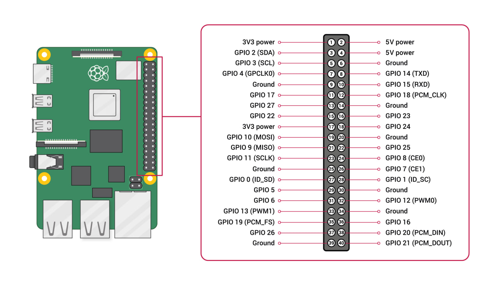
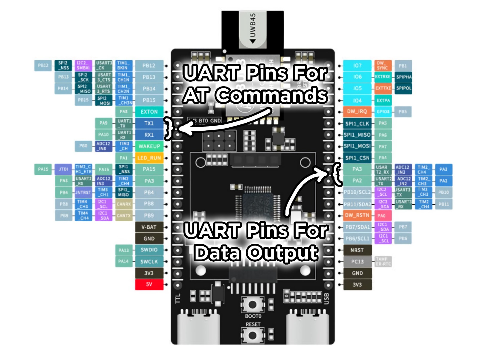

# UWB Configuration Documentation
In this document, you will find a guide on how to go about **configuring and setting up** the UWB modules to be ready for deployment.

## Overview Of Configuration Process
1. Verify UART link (`bu03_detect.py`)
2. Configure each board (`bu03_multi_config.py`)
3. Inspect a board's saved config (`bu03_inspect.py`)
4. Calibrate per-anchor offsets (`viewer_calibrate.py`)
5. Run the game (`game.py`)

For this set up, there will be a total of **6 UWB Modules configrued as *Anchors*** (A00, A01... A05), and **2 UWB Modules configured as *Tags*** (T00, T01). 

For a step by step process on how to configure the UWB Module. Refer to original repo [*here*](https://github.com/huats-club/stage_tracking#workflow-overview).

## Things To Note When Configuring

### Configuring Pin Connection
When preparing to configure UWB module, make sure to **connect data pins (`RX1` -> PA10, `TX1` -> PA9) first** before `3V3` and `GND` pins.
*This is to ensure longevity of the module.*

Used by: `bu03_detect.py`, `bu03_multi_config.py`, `bu03_inspect.py`
| **Raspberry Pi**     | **BU03-Kit** |
|----------------------|--------------|
| Pin 1 (3V3)          | `3V3`          |
| Pin 6 (GND)          | `GND`          |
| Pin 8 (GPIO14, TXD)  | `RX1` (PA10)   |
| Pin 10 (GPIO15, RXD) | `TX1` (PA9)    |

 

### Anchor And Tag IDs
When configuring each UWB module as an Anchor or Tag, make sure that **each module is configured with a unique Anchor ID or Tag ID**. 
*Tracking would not function as expected if there are UWB modules with clashing IDs.*

### Running `game.py` Pin Connection
Take note that the pin connection is different when connecting the **Sensor Pi** to the Anchor to run `game.py`.

Used by: `game.py`, `viewer_calibrate.py`. Wire only the tag board this way (the anchors do not need to be wired to the Pi during live operation — their distances reach the tag wirelessly over UWB).
| **Raspberry Pi**     | **BU03-Kit** |
|----------------------|--------------|
| Pin 1 (3V3)          | `3V3`          |
| Pin 6 (GND)          | `GND`          |
| Pin 8 (GPIO14, TXD)  | `PA3` (USART2_RX)   |
| Pin 10 (GPIO15, RXD) | `PA2` (USART2_TX)    |