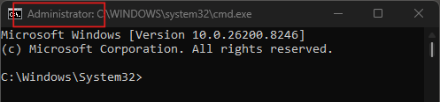
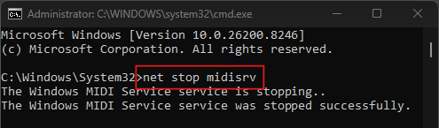
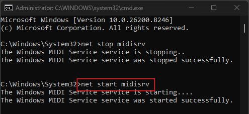

# Windows 11 MIDI Service Bug
Here's how to fix the `Windows 11 26200.7840 Security Update` (February 11th 2026) BUG, preventing LoopMIDI from being detected/working on a DAW. 

1. Run `Command Prompt` as administrator 

2. Enter `net stop midisrv`

3. After Windows MIDI Service has stopped, Enter `net start midisrv`

After re-starting Windows MIDI Service, DAW should be able to detect LoopMIDI's virtual MIDI Port.

[*Debug credits to video here.*](https://youtu.be/wpLTdJVibds?si=mcB7LQ5yytCUog7V)