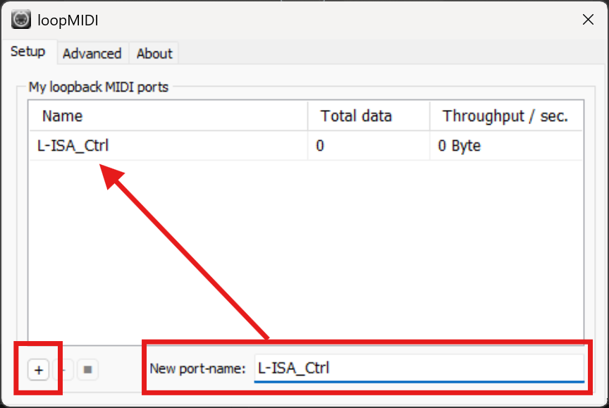
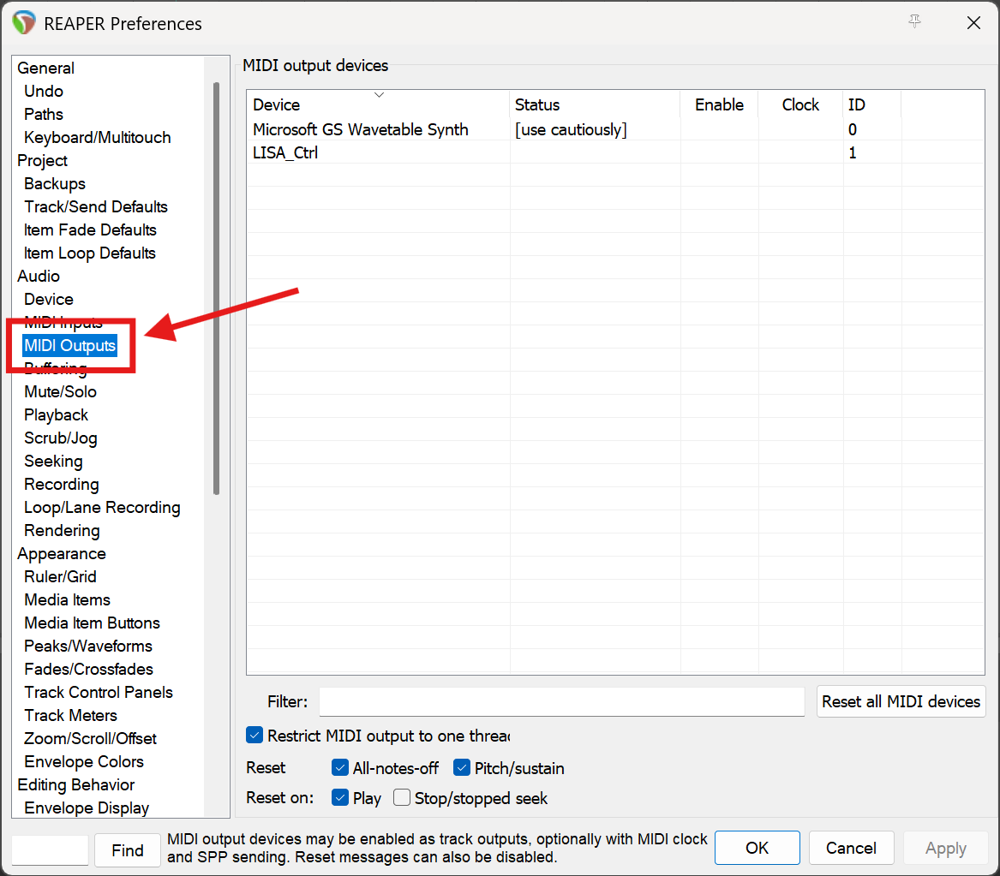
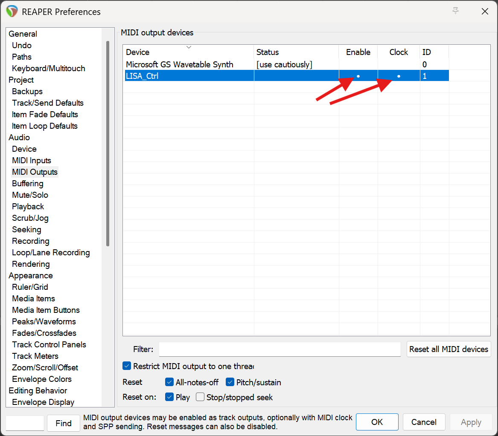
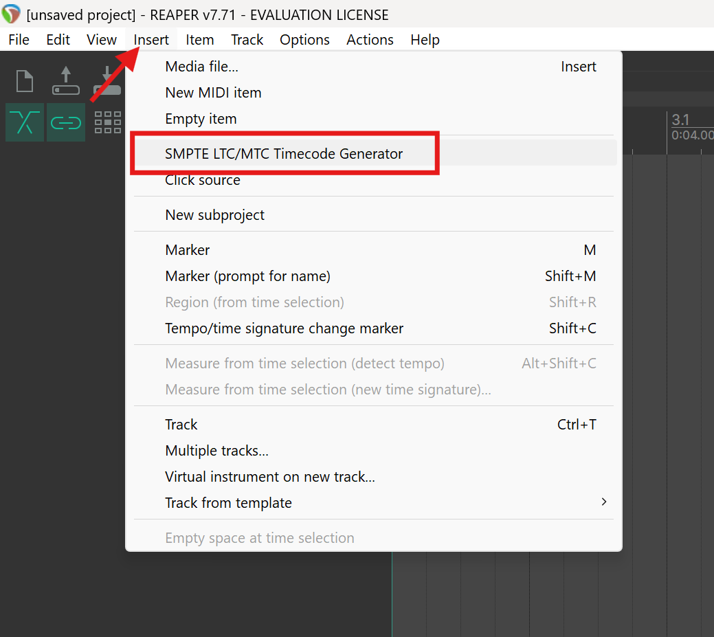
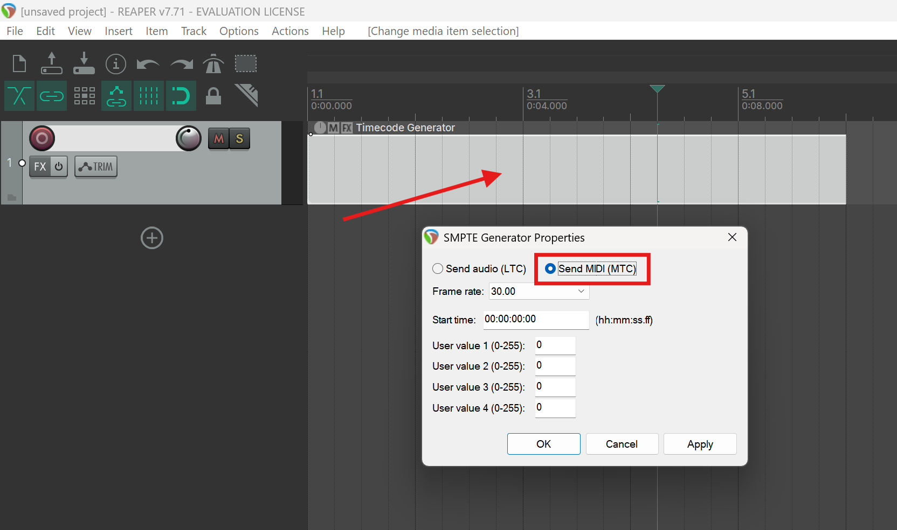
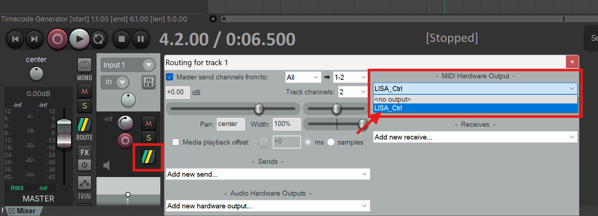
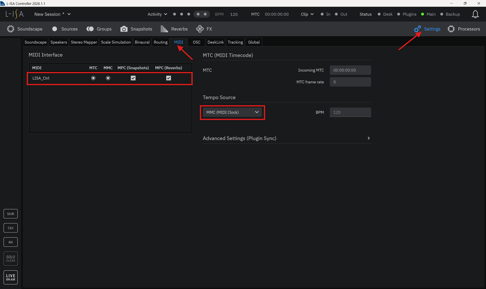

# Reaper MIDI to LISA Configuration
Here's a guide on how to setup `loopMIDI` to allow `Reaper` to `send timecode` data to `L-ISA`.

## Table of Contents
1. [LoopMIDI Installation & Setup](#LoopMIDI-Installation-&-Setup)
2. [Reaper Setup & Configuration](#Reaper-Setup-&-Configuration)
3. [L-ISA Setup & Configuration](#L-ISA-Setup-&-Configuration)

## LoopMIDI Installation & Setup
1. Install `loopMIDI` software [here](#https://www.tobias-erichsen.de/software/loopmidi.html).

2. Create a new **MIDI Port**.

Enter a **desired port name** in the filed at the bottom right, and press the `+` icon on the bottom left. You should **see a new port** with the desired name appear in the list. 

## Reaper Setup & Configuration
1. In `Reaper`, open up the **preferences window** via `ctrl + p`, and look for `MIDI Outputs` tab under Audio. 

2. Under the `MIDI Outputs devices` section, look for the name of the MIDI port that was created earlier in `loopMIDI`, and click the box under `Enable` and `Clock`, to *enable MIDI output* and *send MIDI clock (timecode)* respectively.

*At this point, if MIDI Port cannot be seen, try following [this guide](LoopMIDI_Debug.md) to resolve the issue.*

3. Insert a new `SMPTE LTC/MTC Timecode Generator` track

4. Configure the timecode track to `send MIDI (MTC)`
Doubble click on the inserted timeode track and change the properties to `send MIDI (MTC)`.

5. Configure track's output to the `MIDI Port`.

*At this point, when track is played, it will send the correspnding MIDI Timecode (MTC) via the MIDI port.*

## L-ISA Setup & Configuration
1. Navigate to `MIDI settings` to ensure MIDI Interface is setup.

*Bellow is a demo of the outcome.*
<video controls src="Images/l-isa-mtc.mp4" title="Title"></video>
