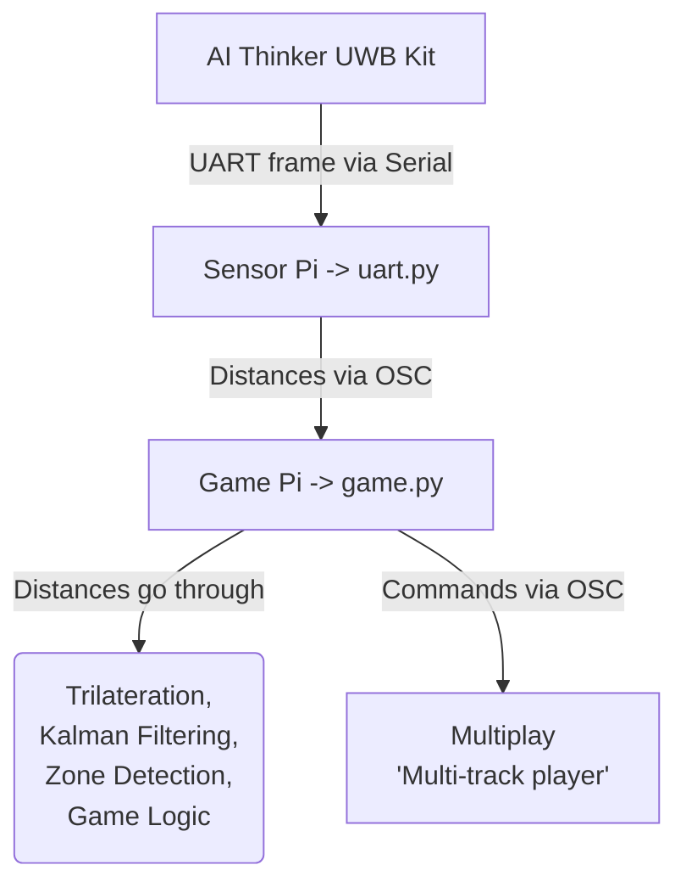
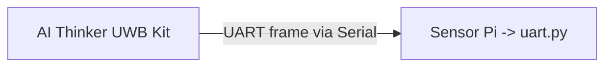
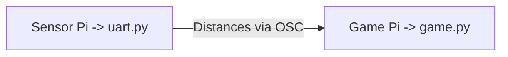
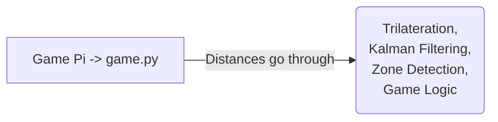
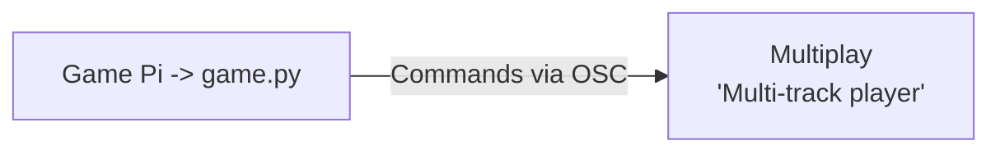

# System Architecure Documentation
In this document, you will find explaination of the software pipeline in this project.


## Overarching Data Flow



## UART Frame via Serial

When `uart.py` is running on the **Senor Pi**, it is actively reading **raw UART frames** from the **BU03-Kit** via the serial port.


## Distances via OSC  

`uart.py` parses UART data into 12 distances (m) per tag *(x and y distance per anchor from tag)*, applies per-anchor calibration offsets, then **broadcasts each frame over OSC** to the **Game Pi** running `game.py`.


## Processes That Distance Values Go Through

Each frame, `game.py` is **trilaterating the distances** to determine the tag's position, **relative to the anchor positions**. 

These distance values are also passed through a **Kalman Filtering** process, which basically creates a **prediction of the next likely position** of tag based on its velocity. 

While tag's positions are being processed, `game.py` is also constantly **checking whether positon of tag coresponds to the zones posititons**. - this would then **trigger the game logics**, be it to increase size of zone, or to trigger an end game sequence.


## Commands Triggering 'MultiPlay' via OSC

Through `game.py` **game logic**, it would determine whether to trigger certain sequences, by **sending an OSC command to MultiPlay** to run a certain audio track. 

For example, when a tag is within a zone, it **triggers a swell audio cue**, by **sending an osc command to MultiPlay** 

```python
osc_tx_multiPlay.send_message("/cue/3/go", "")
```
*^ this triggers cue number 3 on **MultiPlay**.*