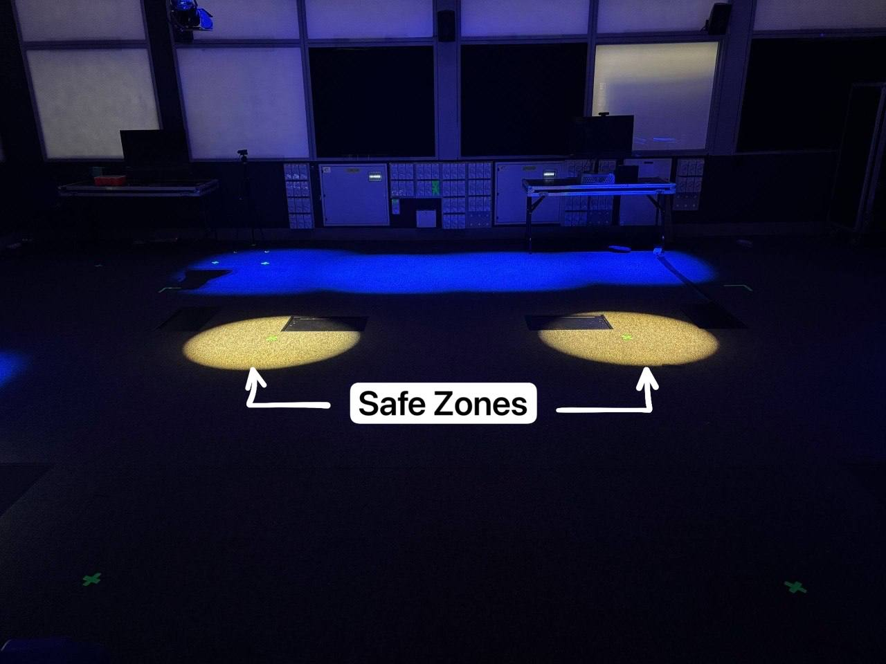
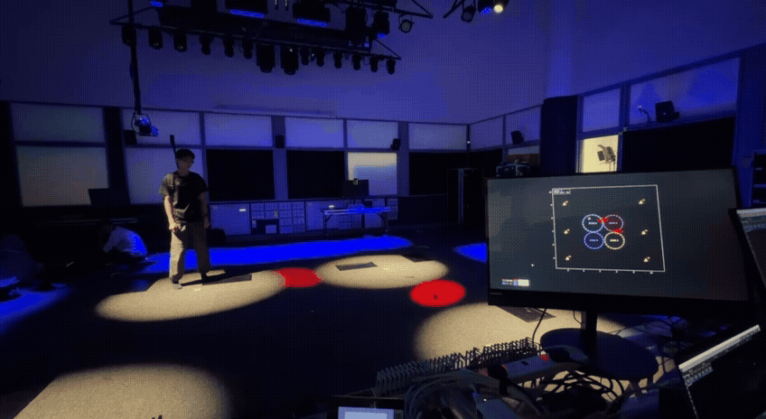
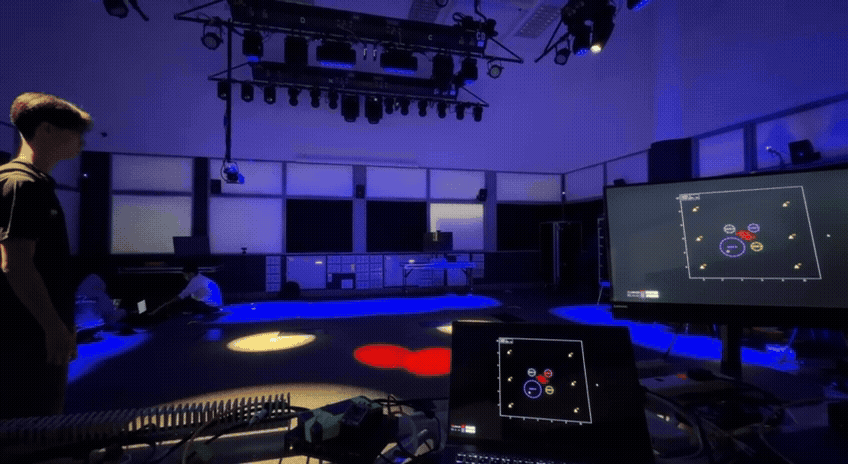
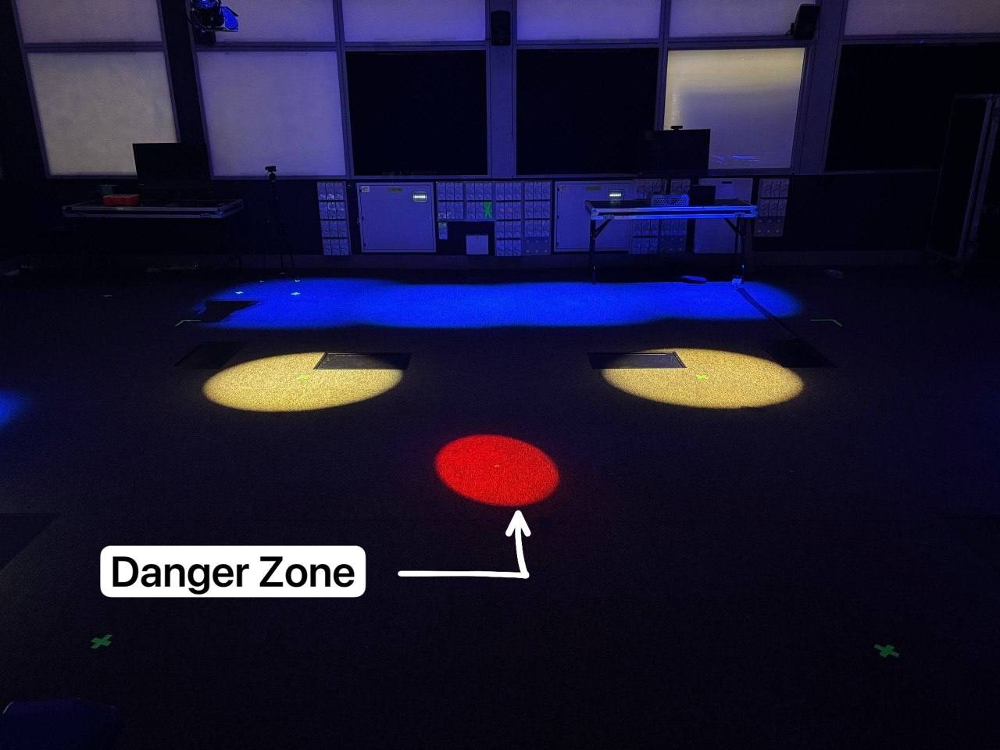

# Game Logic Documentation

## Overview:
This UWB Interactive Game is a multiplayer location-based game in which players physically move around a designated play area to interact with virtual game elements displayed on screen.

Throughout the game, players must work together to keep all Safe Zones alive while avoiding moving Danger Zones. Safe Zones gradually shrink over time and must be maintained by players before they disappear.

The objective of the game is to keep every Safe Zone alive throughout all three rounds while avoiding Danger Zones. Players achieve victory by successfully completing the final round with all Safe Zones still active.

## Game Elements
### Safe Zone
In ViewerApp, it looks like

Physically, this is what the players should see

#### Behavior
Each Safe Zone continuously shrinks over time.

When a player enters a Safe Zone:

- The shrinking immediately stops.
- The Safe Zone expands until it reaches its maximum radius.

When the player leaves:

- The Safe Zone resumes shrinking.

If any Safe Zone reaches its minimum radius, it disappears and the game immediately ends.

### Danger Zone
In ViewerApp, it looks like

Physically, this is what the players see

#### Behavior
Danger Zones continuously move around the play area throughout the game.

If a player enters a Danger Zone:
- Game immediately ends.

Their movement increases the challenge by limiting safe paths between Safe Zones.

## Player Equipment

Before the game begins, each player is required to wear a backpack containing a UWB tracking tag. The tracking tag continuously monitors the player's position within the play area and translates their physical movement into in-game actions.

The backpack allows players to move freely while ensuring the tracking tag remains securely positioned throughout the game.

- Insert a photograph of the backpack with the UWB tag installed.

## Gameplay Flow:

The game is divided into three main stages:

Tutorial
    →
Gameplay
     →
Victory / Game Over

## Stage 1: Tutorial

Before the game starts, players are presented with a tutorial explaining: 

- How player movement is tracked
- The difference between Safe Zones and Danger Zones
- Behavior of Safe and Danger Zones
- How to win or lose the game

To help players understand the game mechanics, the game elements are demonstrated visually.

When the Safe Zone is introduced, the corresponding lights illuminate the floor to display the Safe Zone within the play area.

When the Danger Zone is introduced, the corresponding lights illuminate the floor to demonstrate the appearance of the Danger Zone.

These visual demonstrations allow players to familiarise themselves with the game elements before the gameplay rounds begin.

Once the tutorial is completed, the first gameplay round starts.

## Stage 2: Gameplay Rounds 

The game is divided into three rounds, with each round increasing in difficulty by introducing additional Safe Zones.

|**Round**	| **Safe Zones** |	**Round Duration** |
|----------|------------|----------------|
| 1	     |   2       |	10 seconds   |
| 2	     |   3	  |  15 seconds   | 
| 3       |   4	  |  20 seconds   |

At the beginning of each round, the corresponding number of Safe Zones appears within the play area.  

## Win Condition

Players win if they:

- Successfully complete all three rounds.
- Keep every Safe Zone alive throughout the game.
- Avoid entering any Danger Zone.

When this happens:

- Victory audio is played.
- Victory visuals are displayed.
- The game ends successfully.

## Lose Conditions

The game ends immediately if either of the following occurs.

1. Player Enters a Danger Zone

2. A Safe Zone Disappears

## Audio and Visual Feedback

The game provides immediate feedback through audio and visual effects.

| Event                 | Audio Feedback            | Visual Feedback        |
| --------------------- | ------------------------- | ---------|
| Game Start            | Background music plays    | All illuminated zones for round 1 appears|
| Players enter Safe Zone   | Zone expansion effect | The illuminated Safe Zone expands, until it reaches the maximum size.|
| Players leave Safe Zone   | Zone expansion effect stop |The illuminated Safe Zone gradually shrinks.|
| Players enter Danger Zone | Warning followed by Game Over sound | All illuminated zones stop moving|
| Round Complete            | Winning audio cue   | All illuminated zones stop moving.|
| Victory                   | Victory sound |All illuminated zones disappears|

This feedback helps players understand what is happening during gameplay without needing to look at technical information.

<!-- 
## Technologies Demonstracted:
The UWB Interactive Game demonstrates the integration of multiple hardware and software technologies to create a real-time, location-based interactive game experience. The gameplay mechanics are supported by several embedded systems, communication protocols, and real-time processing techniques.

| **Technology**      | **Description**           |
|---------------------|-----------------------|
| Technology	Description Ultra-Wideband (UWB) Positioning |Utilises AI Thinker UWB modules to accurately determine the real-time positions of players within the play area.
|Indoor Localization        |Calculates player locations using distance measurements obtained from multiple fixed UWB anchors. |
| UART Serial Communication              |Transfers raw distance measurements from the UWB hardware to the Sensor Raspberry Pi for processing.       |
|      Open Sound Control (OSC)      | Enables communication between the Sensor Pi, Game Pi, grandMA and Reaper for transmitting tracking data and triggering audio events.     |
|      Trilateration      | Computes player coordinates using distance measurements collected from multiple UWB anchors.    |
|      Kalman Filtering     | Reduces measurement noise and provides smoother player position tracking for more stable gameplay.     | -->
