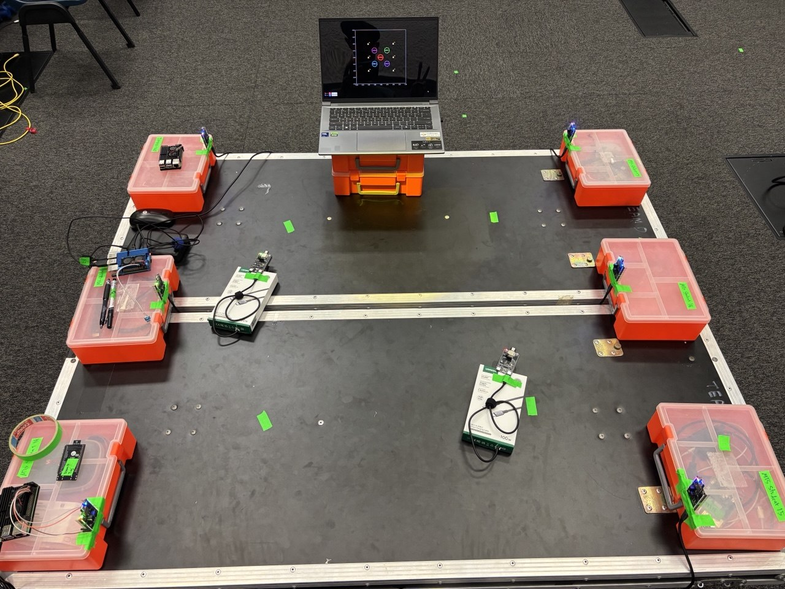

# Hardware Set-up Documentation
In this document, you will get to see how the game setup looks like.

1. Here we are using a laptop to run the plotting graph for users to locate the safe zones and danger zones. On the right is our tag used to track the players.

2. This is how our setup looks like, each container on the table marks as a anchor to try and keep the players within the playing area. There are six anchors in total and two tags for two players. The tags will be held and move around by the players in the game.

3. All the tags are powered by a power bank. As for the anchors, they are stationary and connected to a power strip instead of a power bank. The first anchor which is A00 is our main anchor where we connected it to our Raspberri PI.

## Draft Tag holder design
1. Below is our creative design for our tags used in our game and how it is implemented with our tag and powerbank.

2. This is just a draft design/idea, not the end product design. The design is supposed to replicate a candle tray with a candle in the middle. 
 

3. The tray is meant to be used to placed the powerbank and a lid to conceal it. 

4. Lastly the candle holder is a hollow object meant to store the tag.

5. Beneath the candle holder is a hole to allow the type c cable to run from the powerbank to the tag to power it throughout the duration of the game. 

6. Players will move around in the game trying to light up the room as they move into the safe zones with the candle tray.

