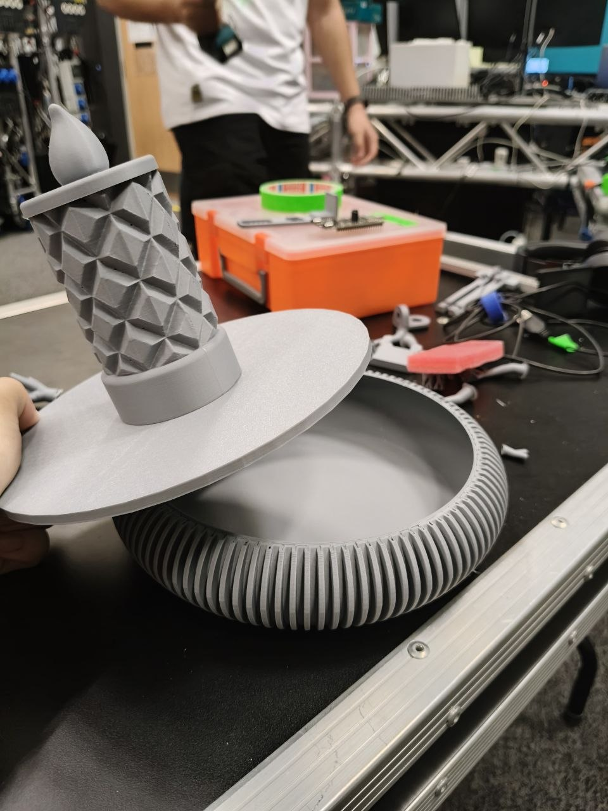
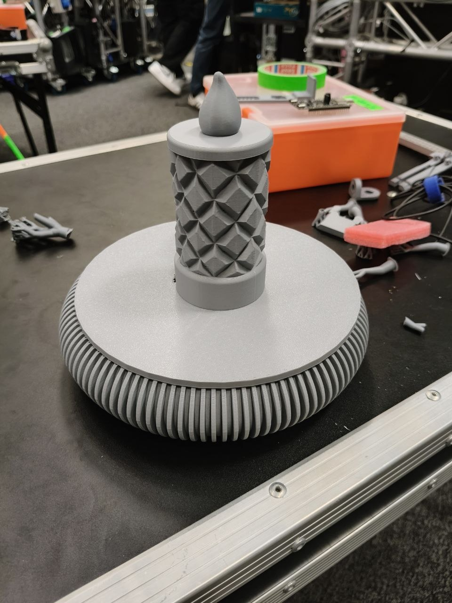
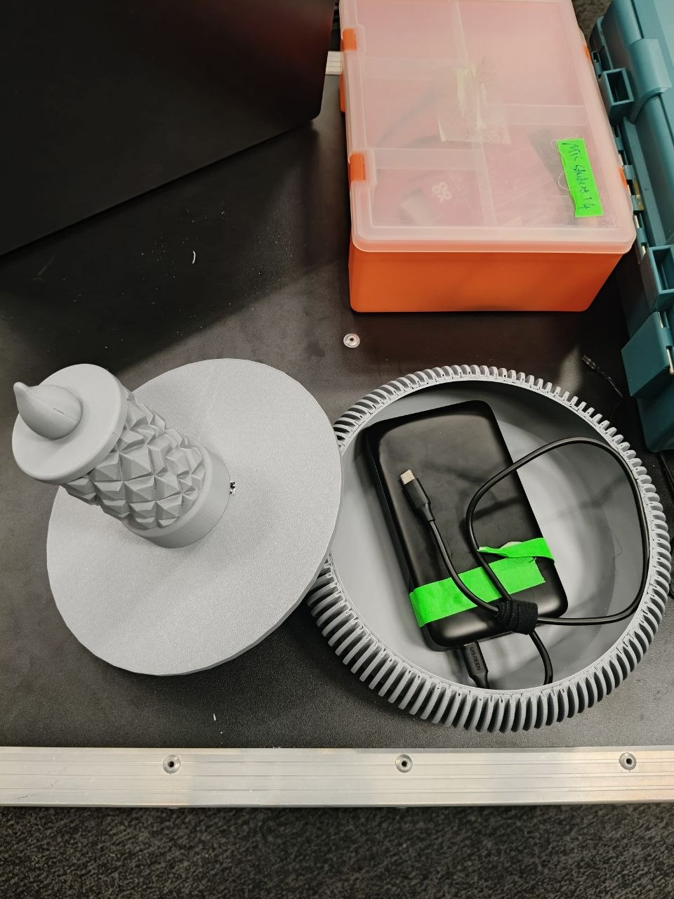
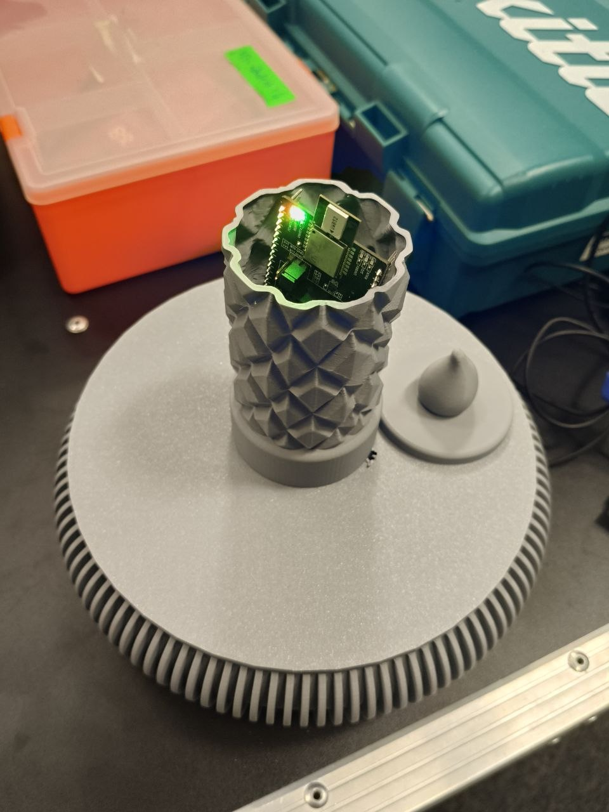
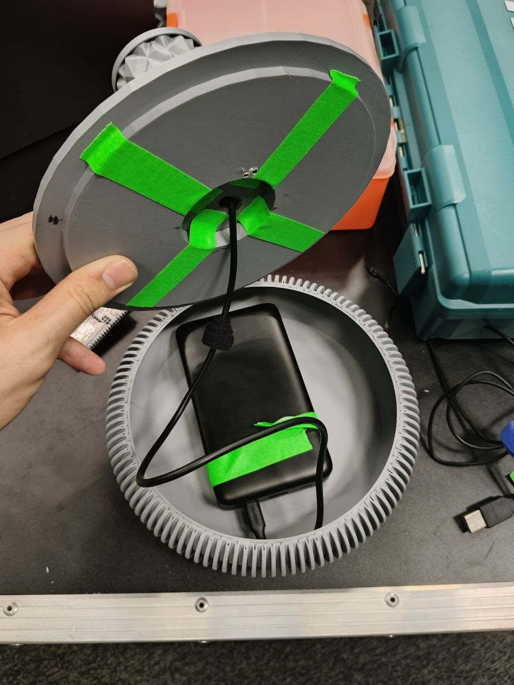

# Hardware Set-up Documentation
UWB Tag Holder
Overview

The UWB tag holder was designed to securely hold the UWB tag during gameplay while allowing it to be positioned at different angles. Instead of designing a holder from scratch, an existing open-source 3D model was used as the base and modified to fit the UWB tag.

Original model used
https://makerworld.com/en/models/2815216-heavy-duty-gravity-phone-mount-articulated-arm?from=search#profileId-3134209

 **2**.**Materials Required**                    
| **Item**                                          | **Purpose**                  |
| ---------------------------------------------- | ------------------------ |
| 3D Printer                                     | Print all required parts |
| PLA/PETG filament                              | Printing material        |
| UWB Tag                                        | Device to be mounted     |
| Elastic band                                   | Keeps the holder closed  |
| Super glue (if required)                       | Secures modified parts   |
| CAD software (Fusion 360/Onshape/Bambu Studio) | Modify the holder design |
**3**
This is just 1 of the 6 finish product that we made.Noted that we did not use every single part of the arm,and clamp and we only used what we though was needed for us.

**4** We made a special holder for the tag to sit on so that it would not drop.Below is a picture of how holder was made for the tag.

## Draft Tag holder design
1. Below is our creative design for our tags used in our game and how it is implemented with our tag and powerbank.

2. This is just a draft design/idea, not the end product design. The design is supposed to replicate a candle tray with a candle in the middle. 
 

3. The tray is meant to be used to placed the powerbank and a lid to conceal it. 

4. Lastly the candle holder is a hollow object meant to store the tag.

5. Beneath the candle holder is a hole to allow the type c cable to run from the powerbank to the tag to power it throughout the duration of the game. 

6. Players will move around in the game trying to light up the room as they move into the safe zones with the candle tray.

