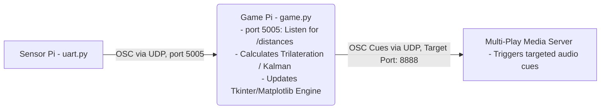

# OSC References Documentation
The UWB Interactive Game System uses Open Sound Control (OSC) messages for communication between different subsystems.

## Communication Flow

The OSC communication layer serves two purposes:

1. Transmitting UWB distance measurements from the Sensor Pi to the Game Pi.

2. Triggering audio and media events from the Game Pi to the Multiplay media server.

## Sensor Pi -> Game Pi
The `uart.py` script reads UART data from the AI Thinker BU03 UWB receiver and forwards the processed distance measurements to the Game Pi via OSC.

| **OSC Address**   | **Arguments**    | **Description**    | **Trigger**        |
|-------------------|------------------|--------------------|--------------------|
| `/distances`      | `tag_id(int)` `d0...d7(float)`   |Transmits the latest distance measurements between a tracked tag and all anchors.|Sent whenever a complete UWB measurement frame is received from the BU03 receiver.

### Receiver Behaviour
The Game Pi:
1. Receives the distance measurements.
2. Performs trilateration.
3. Calculates the player's position.
4. Updates the game state.

## Game Pi -> Multiplay 
The `game.py` script sends OSC messages to the Multiplay media server to trigger audio effects.

| **Event**           | **OSC Address**       | **Trigger**       |
|---------------------|--------------------   |-------------------|
| Game Start          |   `/cue/1/go`         | Sent when the game starts.  |
| Zone Entered        | `/cue/3/go` `/cue/4/go` `/cue/5/go` `/cue/6/go` | Sent when a player successfully enters a designated zone.  |
| Players Exit Zone   | `/cue/3/stop` `/cue/4/stop` `/cue/5/stop` `/cue/6/stop` | Sent when a player exits the designated zone.  |
|Zone A fully expanded| `/cue/7/go` `/cue/3/stop` | Fires Zone A stinger audio track; terminates base Zone A loop.|
|Zone B fully expanded| `/cue/8/go` `/cue/4/stop` | Fires Zone B stinger audio track; terminates base Zone A loop.|
|Zone C fully expanded| `/cue/9/go` `/cue/5/stop` | Fires Zone C stinger audio track; terminates base Zone A loop.|
|Zone D fully expanded| `/cue/10/go` `/cue/6/stop`| Fires Zone D stinger audio track; terminates base Zone A loop.|
|Game over            | `/stopall` `/cue/2/go`    |  Sent when a player loses the game.|
|Victory              | `/stopall` `/cue/11/go`  |Sent when the player completes all objectives and wins the game.  |

### Receiver Behaviour
Multiplay Media :
- Starts the background music and gameplay sequence.
- Plays the corresponding zone activation sound effect.
- Stops all currently playing audio and media.
- Plays the victory music and end-game sequence. 

- Processes explicit play states (`/go`) and kill states (`/stop`) independently per zone track, allowing multi-layered audio streams to toggle smoothly based on live player positioning.

- Interrupts background loops with critical priority stingers (Cues 7–10) when receiving zone max-expansion thresholds, cleaning up the mix by halting the overlapping base channel.

##  Outbound Event Tracking (Internal State Logs)
The following tables document the logical game events processed by `game.py`. While these statuses are printed to the local terminal for debugging and tracking system states, they are translated internally into direct media playback controls before transmission over the network.
### Note 
The OSC addresses listed below represent logical game events used within the system design. The actual OSC cues currently sent to the Multiplay media server are in the table above.

### Core Game States

| **OSC Address**      | **Trigger**           |
|---------------------|-----------------------|
| `/start`            |Sent when player clears the tutorial  |
| `/gameover`         |Sent when player violates survival objectives (e.g., entering a critical danger zone structure) |
| `/win`              |Sent when all countdown criteria are successfully met and the survival timer reaches 0s.        |

### Dynamic Arena  Mechanics

| **OSC Address**      | **Arguments**                          | **Trigger**       |
|---------------------|----------------------------------------|-------------------|
| `/zone/expand`      |  `zone_id(int)` `radius(float)`        |When Zone grows       |
| `/zone/shrink`      |  `zone_id(int)` `radius(float)`        |When Zone contracts   |

| **OSC Address**      | **Arguments**                 | **Trigger**                   |
|---------------------|-------------------------------|-------------------------------|
| `/zone/enter`       |  `zone_id(int)` `tag_id(int)` |Sent when a player steps into a zone boundary.  |      
| `/zone/exit`        |  `zone_id(int)` `tag_id(int)` |Sent when player leaves a zone.                 |

