# Software Set-up Documentation
In this document, you will find a guide on how to go about software set-up for the respective hardwares involved in the system. 

Documentation Guide:
* [1. Raspberry Pi Set-up](#1-Raspberry-Pi-Set-up)
* [2. `uart.py` Set-Up](#2-`uart.py`-Set-Up)
* [3. `game.py` Set-Up](#3-`game.py`-Set-Up)
* [4. REAPER Setup](#4-REAPER-Set-Up)
    * [4.1. L-ISA Processor](#41-L-ISA-Processor)
    * [4.2. L-ISA Controller](#42-L-ISA-Controller)
    * [4.3. REAPER](#43-REAPER)
* [5. GrandMA3 Setup](#5-GrandMA3-Set-Up)
* [6. Appendix](#6-`game.py`-Set-Up)
    * [6.1. Lasptop as Game Pi Set-up](#61-Laptop-as-Game-Pi-Set-up)

---

## 1. Raspberry Pi Set-up 
### Hardware
1. Single Board Computer: Raspberry Pi 4 Model B
2. Operating System: Raspbian Buster Full

### Initital Set-up of Raspberry Pi (first boot)
This is a **crucial step**, to set up the Raspberry Pi that will be used. *[Reference to a step by step guide here](https://github.com/huats-club/rpistarterkit#setting-up-the-raspberry-pi-first-initial-boot)*.
- Updating of Raspberry Pi
- Updating of date
- Enabling SSH
- Enabling VNC
- Enabling HDMI Hotplug
- Disabling Screen Blanking
- Configuring Static IP
- Python Virtual Environtment (venv) Creation

### Venv Set-up and Python Dependencies
This is the Venv that you will install all the required Python Dependencies in, and the Venv that you will be running either `uart.py` or `game.py` in.
#### Activating Venv 
1. Open your terminal and navigate to your project directory:
```bash
cd /path/to/your/project
```
2. Run the activation command based on your target folder name:
```bash
source <venv_name>/bin/activate
```
#### Installing Python Dependencies
```bash
sudo apt-get update
pip3 install python-osc==1.8.1
pip install pyserial matplotlib
sudo apt-get install -y libopenblas-dev python3-pil.imagetk
```
| **Package**         | **Used by**                            |
|---------------------|----------------------------------------|
| `pythonosc`           | `uart.py` & `game.py` — data transfer via UDP |
| `pyserial`            | uwb-config-files & `uart.py` — UART I/O       |
| `matplotlib`          | `game.py` — embedded plot                     |
| `python3-pil.imagetk` | Tkinter image rendering for matplotlib        |      
| `libopenblas-dev`     | NumPy / matplotlib acceleration               |

---

## 2. `uart.py` Set-Up
### Set up of default OSC Host IP and Port (receiver - Pi running `game.py`)
Before running `uart.py` on the **Sensor Pi**
At line 50 and 51 of `uart.py` change the default host IP, and the port that host is receiving osc message at accordingly.
```python
DEFAULT_HOST = "X.X.X.X"
DEFAULT_PORT = 5005
```

### Host IP and Port Override via CLI
When running `uart.py` you can overide the defalt Host IP and Port.
```python
python3 uart.py --host 192.168.1.XX --port 5005
```

### Configuring Number of Tags to Capture via CLI
```python
python3 uart.py --tags X
```
**Important note: the value of `X` has to be the same as that set at `game.py`.*

---

## 3. `game.py` Set-Up
### Set up of OSC Target IP and Port (receiver - device running MultiPlay)
Before running `game.py` on the **Game Pi**
At line 48 and 49 of `game.py` change the default target IP, and the port that target is receiving osc message at accordingly.
```python
OSC_TARGET_IP = "192.168.254.189"    # IP of laptop running Multi-play
OSC_TARGET_PORT = 8888
```

### Receiving Port Override via CLI
```python
python3 uart.py --port 5005
```

### Configuring Number of Tags via CLI
```python
python3 game.py --tags X
```
**Important note: the value of `X` has to be the same as that set at `uart.py`. else default at 2*

### Tag Simulation Mode
In development, if you want to **simulate a tag position and movment** using mouse position on window
```python
python3 game.py --simulate
```

---

## 4. REAPER Laptop Set-Up
### Hardware
1. Laptop running
    - REAPER
    - L-ISA Processor & Controller
    - Dante Virtual Soundcard (DVS)
    - LoopMIDI

---

### 4.1 L-ISA Processor
#### About L-ISA Processor (Desktop)
L-ISA Processor Desktop is a software-based spatial audio processor included in the L-ISA Studio software suite. It provides the processing capabilities of an L-ISA hardware processor directly on a Windows or macOS computer without requiring dedicated processing hardware.

In this project, audio from REAPER is routed through the L-ISA Audio Bridge into L-ISA Processor Desktop. The software then applies the sound positioning and spatial effects configured in L-ISA Controller before sending the processed audio to the selected audio output device.

Some relevant features include:
1. Software-based spatial audio processing
2. Processing of up to 96 individual audio objects
3. Support for up to 16 audio outputs
4. Control of sound position, width, distance, and elevation
5. Object-based room and spatial effects
6. Binaural monitoring through headphones
7. Multi-speaker immersive audio output
8. Integration with L-ISA Controller
9. Audio routing through L-ISA Audio Bridge
10. Output through headphones or a compatible audio interface

Below are some links that may be useful.
- For more information about **L-ISA Processor Desktop**, visit the [L-ISA Processor Desktop guide](https://www.l-acoustics.com/stories/create-spatial-audio-l-isa-studio-desktop-processor-setup/)
- For more information about the complete **L-ISA Studio** software suite, visit the [L-ISA Studio product page](https://www.l-acoustics.com/products/l-isa-studio/)
- To download **L-ISA Studio**, visit the [L-ISA Studio download page](https://www.l-acoustics.com/products/l-isa-studio/) 


#### L-ISA Processor Set-up & Configuration
1. Select Network interface as the interface that Dante Network is on (red box)
2. Select **ASIO** as the Audio Device Type (yellow box)
3. Select **Dante Virtual Soundcard** as the Output (green box)
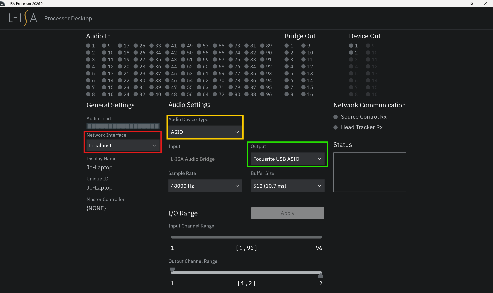


---

### 4.2 L-ISA Controller
#### About L-ISA Controller
L-ISA Controller is the software interface used to configure and control the L-ISA spatial audio system. It allows the operator to place and move individual sound sources within a virtual three-dimensional space.

The software sends control instructions to the L-ISA Processor, which performs the actual audio processing. In this project, L-ISA Controller is used to manage the spatial position and movement of the audio tracks played from REAPER.

Some relevant features include:
1. Control of sound position, width, distance, and elevation
2. Creation of sound movements and trajectories
3. Snapshot programming and recall
4. Spatial effects and room simulation
5. MIDI Time Code synchronization
6. OSC control and external system integration
7. Real-time monitoring of the spatial audio mix

Below are some links that may be useful.
- For more information about **L-ISA Controller**, visit the [L-ISA Controller product page](https://www.l-acoustics.com/products/l-isa-controller/)
- To download **L-ISA Controller**, visit the [L-ISA Controller download page](https://www.l-acoustics.com/products/l-isa-controller/)
- For manuals and technical information, visit the [L-Acoustics Documentation Centre](https://www.l-acoustics.com/result-documentation-center/?choice=L-ISA%20Controller#page-1)


#### L-ISA Controller Set-up & Configuration
#### Connecting L-ISA Prcessor to L-ISA Controller
1. Click **Processors** to go to Processor connection window (red box)
2. To connect `L-ISA Prcoessor` to `L-ISA Controller`, click **'connect'** (yellow box)  
*(note: it will toggle between connect and disconnec. If connected will see green arrow)*
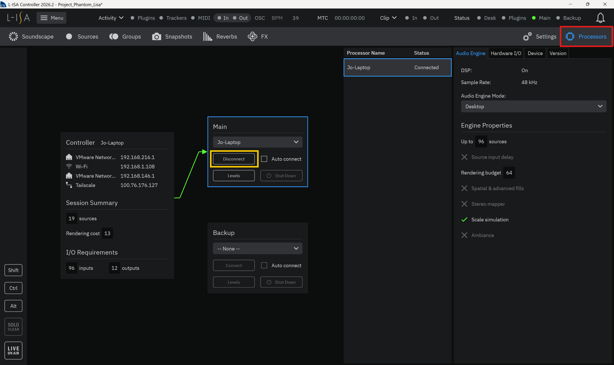

#### Configuring Speaker Output Positions and Routing
1. Click **Settings** to go to Settings window (red box)
2. To go to speaker configuration, click **'Spekaers'** (yellow box)  
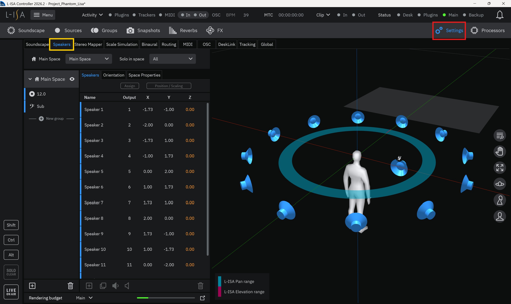
3. To route speaker, **select the desired speaker** in the visualiser on the right (red box)
4. Followed by **clicking the respective Output** coloumn to open up the routing page (yellow box)
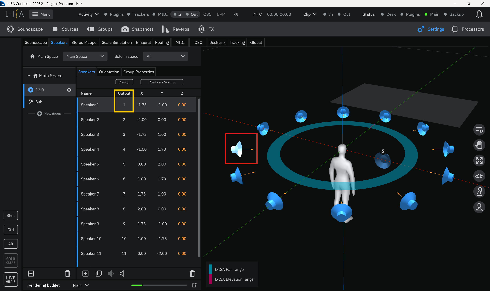
5. In the routing page, **select the desired routing** for your speaker (red box)
6. To confirm and save changes, click **'Save'** (yellow box)
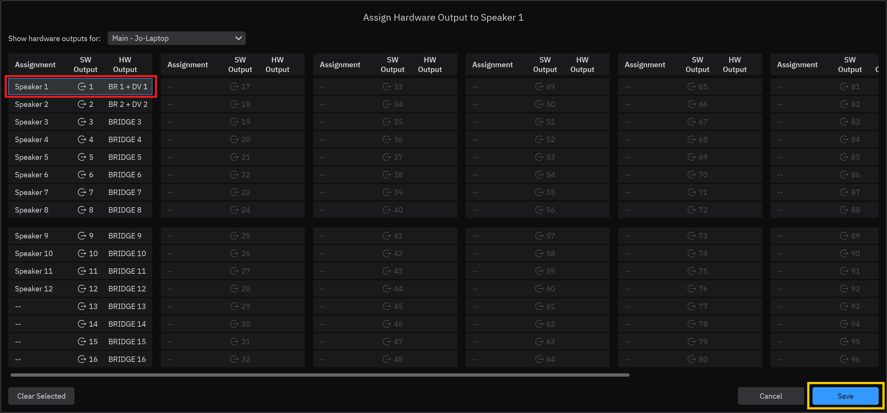

#### Setting up reciving MTC from REAPER
For a detailed step by step guide refer to a guide [here](../../LoopMIDI%20Integration/Reaper_midi_to_LISA.md).


---

### 4.3 REAPER
#### About REAPER
REAPER is a digital audio workstation developed by Cockos for recording, editing, arranging, processing, and playing audio and MIDI.

In this project, REAPER acts as the main audio playback system. It plays the music and sound-effect tracks, sends audio to the L-ISA Processor, and communicates with other parts of the system using OSC and MIDI Time Code.

Some relevant features include:
1. Multi-track audio
2. Flexible audio routing
3. Audio editing and mixing
4. Cue and timeline-based playback
5. Volume, effect, and parameter automation
6. OSC control over a network
7. MIDI and MIDI Time Code output
8. Support for scripts, actions, and external controllers
9. Multi-channel and surround-audio routing

Below are some links that may be useful.
- For more information about **REAPER**, visit the [REAPER website](https://www.reaper.fm/)
- To download and install **REAPER**, visit the [REAPER download page](https://www.reaper.fm/download.php)
- For the **REAPER User Guide**, visit the [REAPER documentation page](https://www.reaper.fm/userguide.php)
- For information about OSC control in **REAPER**, visit the [REAPER OSC documentation](https://www.reaper.fm/sdk/osc/osc.php)


### REAPER Set-up & Configuration
#### OSC Configuration
1. Go to **Reaper Preference** using the shortcup `Ctrl + P`
2. Navigate to **Control/OSC/Web** (red box)
3. Cick on `Add` to configure new OSC Device (green box)
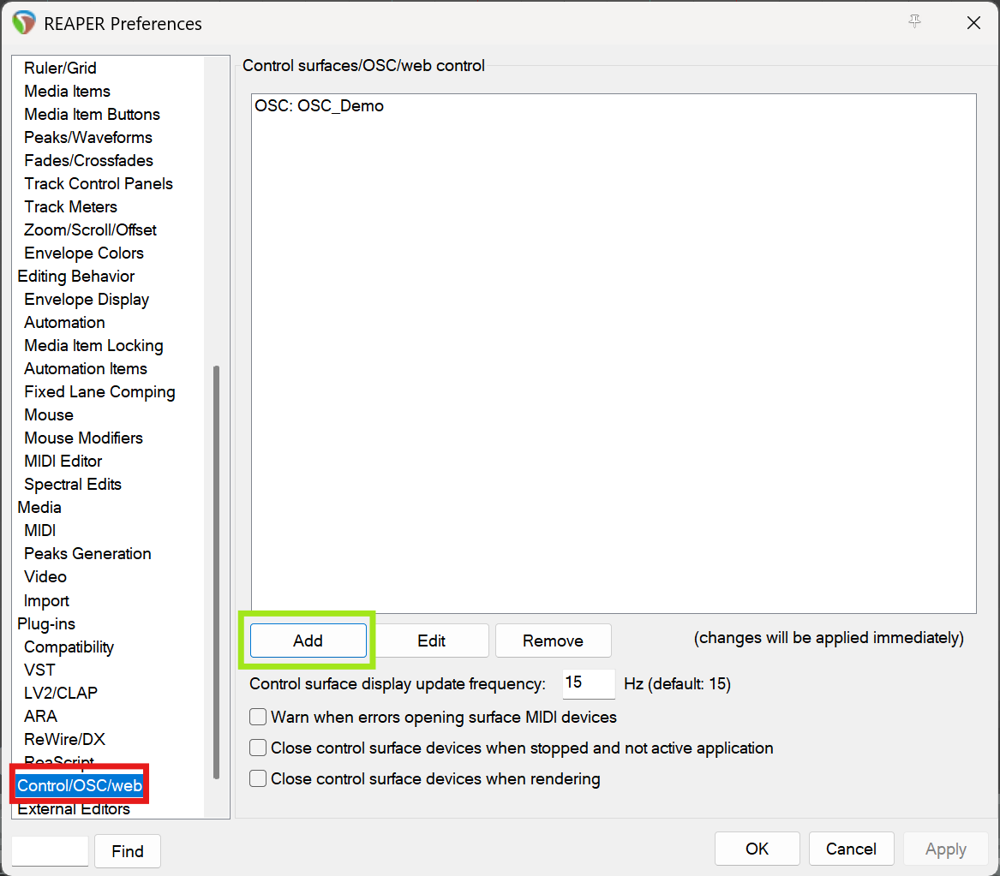
4. Configure new **OSC Device** following these steps
    - Select **OSC (Open Sound Control)** (red box) 
    - Enter **desired name** (yellow box)
    - Select **Configure device IP+local port** (blue box)
    - Enter in respective port and IP details.
    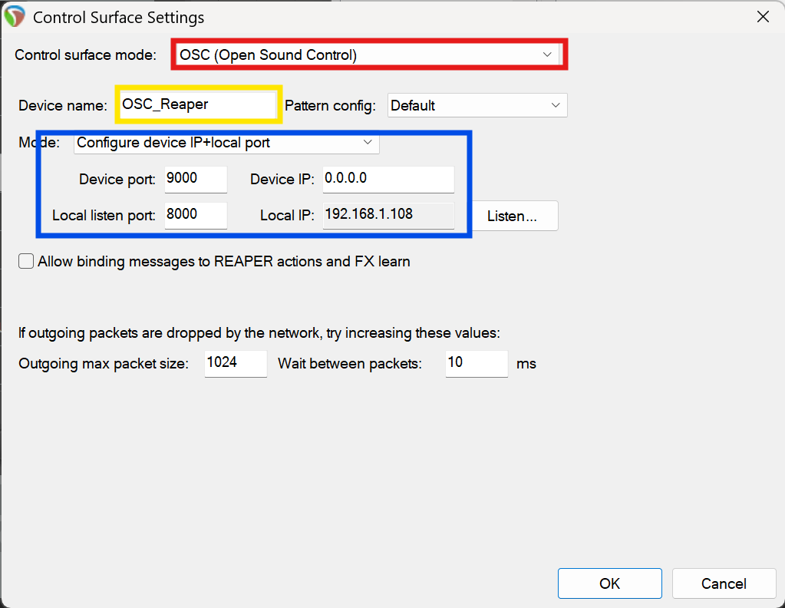
    *^ Important Note: the **Local listen port** must match the port number entered in python osc sender script.*


#### Track Routing Set-up
There are two ways to route your tracks.  
#### Per track routing set-up
1. Open the **Mixer panel** using the shortcut `Ctrl + M`
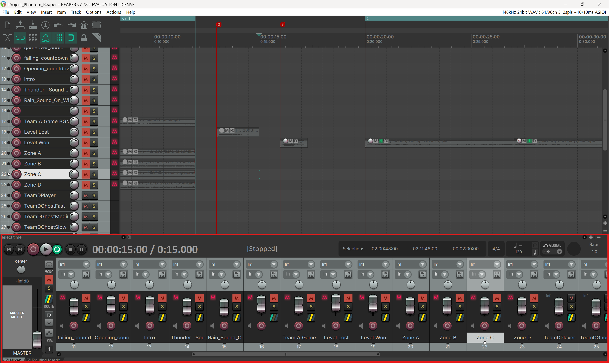
2. Select the **track routing button** on desired track (red box)
3. To route, click **Add new hardware output...** and select desired output (green box)
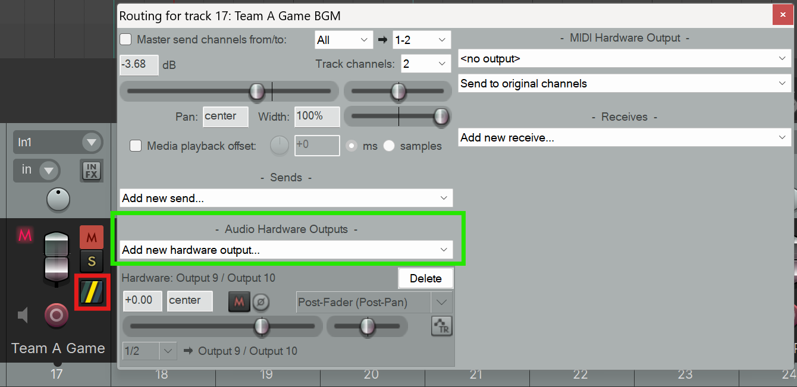


#### Routing matrix
1. Open the **Routing Matrix panel** using the shortcut `Alt + R`
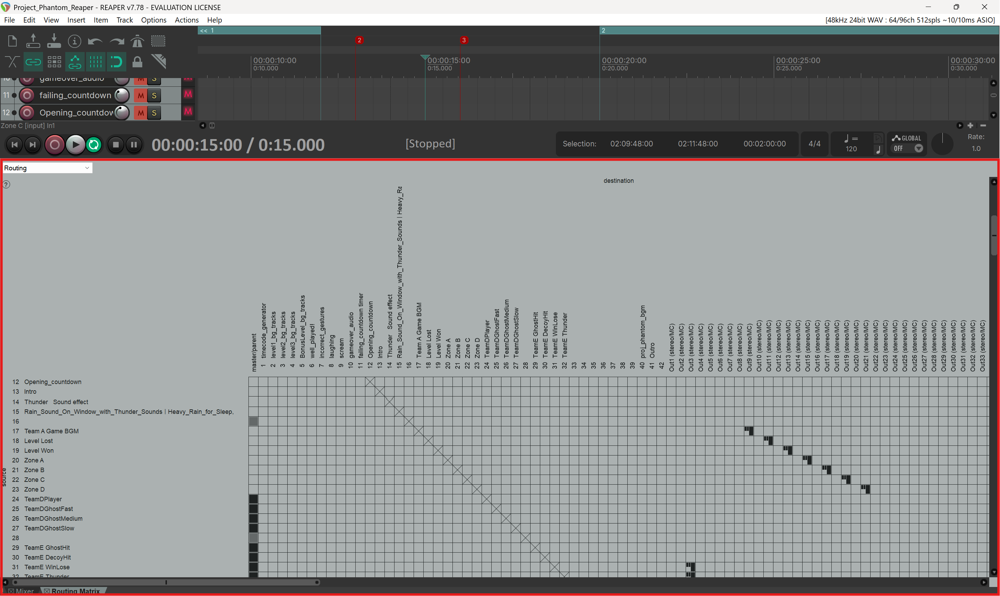
2. Click on the corresponding box to route the **desired track** to the **respective output**


#### MTC to L-ISA Controller Set-up
In an *overview*, to **send MIDI-Timeclock to L-ISA Controller from REAPER**
1. Create MIDI Port via LoopMIDI
2. Setup MIDI Time Clock generator on REAPER Track
3. Send MIDI Time Clock via the MIDI Port
4. Set to recieve MTC on L-ISA Controller

For a detailed step by step guide refer to a guide [here](../../LoopMIDI%20Integration/Reaper_midi_to_LISA.md).


----

## 5. GrandMA3 Set-Up
### Hardware
1. Laptop running
    - GrandMA3 onPC
2. GrandMA Node 
3. Lighting Fixtures

#### About GrandMA3
grandMA3 is a professional lighting-control platform developed by MA Lighting. It is used to configure lighting fixtures, create lighting looks, program cues, and control lighting during live productions.

In this project, grandMA3 onPC receives OSC commands from the Python game application. These commands trigger programmed lighting sequences that respond to game events. Lighting data is then sent through a grandMA3 node to the connected lighting fixtures.

Some relevant features include:
1. Lighting-fixture patching and configuration
2. Creation of presets and lighting looks
3. Cue and sequence programming
4. Executor-based playback control
5. Phaser and lighting-effect programming
6. OSC input and output
7. Network communication with grandMA3 nodes
8. DMX output to lighting fixtures
9. Show-file storage and backup
10. Pre-programming and lighting visualization

Below are some links that may be useful.
- For more information about **grandMA3**, visit the [grandMA3 product page](https://www.malighting.com/grandma3/)
- To download **grandMA3 onPC**, visit the [MA Lighting download page](https://www.malighting.com/downloads/products/grandma3/)
- For the **grandMA3 User Manual**, visit the [grandMA3 Help website](https://help.malighting.com/grandMA3/)
- For information about OSC configuration, visit the [grandMA3 OSC documentation](https://help.malighting.com/grandMA3/2.3/HTML/remote_inputs_osc.html)

#### GrandMA3 Set-up & Configuration
#### Setting up OSC Reciving Commands
1. To **enter OSC config window**, click the **gearbox icon** (top right red box)
2. Followed by **In & Out** (middle yellow box)
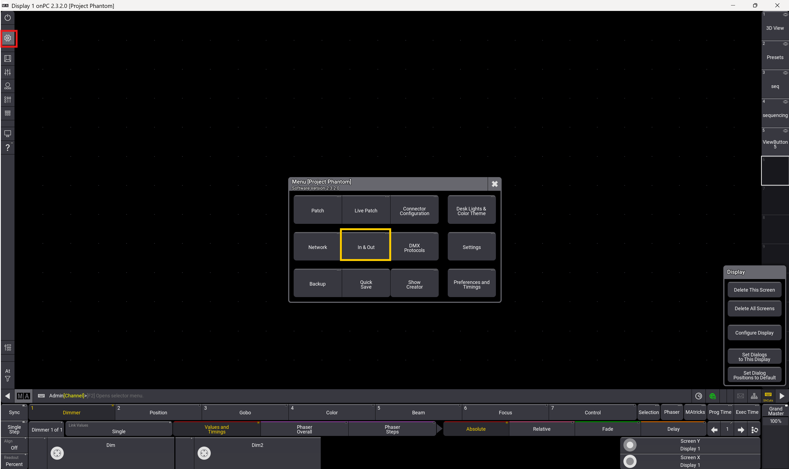
3. In the **In & Out settings** page, select **OSC** (red box)
4. To make a new OSC Data, click **'New OSC Data'** (yellow box)
5. Ensure **Network Interface** is **matching** with **Destination IP** (green box)  
*(Note: This is the network interface where GrandMA will recieve commands from)*
6. Ensure **Mode** is **'UDP'** (blue box)
7. Set **Port** to **'8080'** (orange box)
8. Set **Prefix** to **'gma3'** (pink box)
9. Ensure to **toggle 'Recieve' and 'Recieve Command'** to be **'Yes'** (purple box)
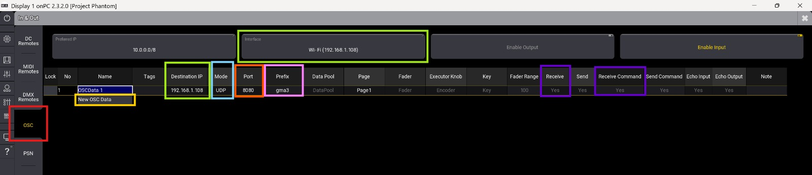


## 6. Appendix 
### 6.1 Laptop as Game Pi Set-up
#### Venv Creation
1. Install Miniconda3

Download zip file containing installer [here](assets/Miniconda3-latest-Windows-x86_64.zip).

2. Open the **Windows Start Menu**. Search for and open **Anaconda Prompt** or **Anaconda PowerShell Prompt**.

3. Run the creation command and specify your desired Python version: (in this case, 3.11)
```batch
conda create -n <venv_name> python=3.11
```
Press `y` when prompted to confirm the installation of base packages


#### Venv Activation
```batch
conda activate <venv_name>
```

#### Installing Python Dependencies
```bash
pip install python-osc==1.8.1
pip install pyserial matplotlib
conda install pillow
```
| **Package**         | **Used by**                            |
|---------------------|----------------------------------------|
| `pythonosc`         | `uart.py` & `game.py` — data transfer via UDP |
| `pyserial`          | uwb-config-files & `uart.py` — UART I/O       |
| `matplotlib`        | `game.py` — embedded plot                     |
| `pillow`            | Tkinter image rendering for matplotlib        |      

