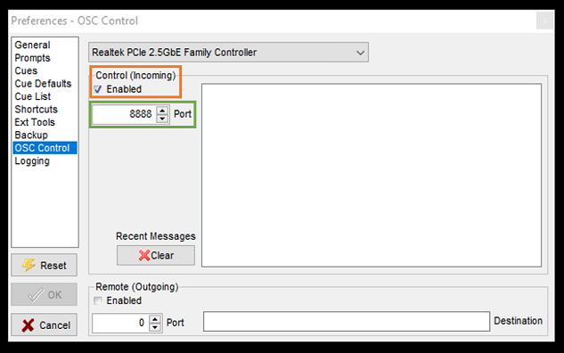

# Software Set-up Documentation
In this document, you will find a guide on how to go about software set-up for the respective hardwares involved in the system. 

Documentation Guide:
* [1. Raspberry Pi Set-up](#1-Raspberry-Pi-Set-up)
* [2. `uart.py` Set-Up](#2-`uart.py`-Set-Up)
* [3. `game.py` Set-Up](#3-`game.py`-Set-Up)
* [4. MultiPlay Setup](#2-`uart.py`-Set-Up)
* [5. Appendix](#3-`game.py`-Set-Up)
    * [5.1. Lasptop as Game Pi Set-up](#51-Laptop-as-Game-Pi-Set-up)


## 1. Raspberry Pi Set-up 
### Hardware
1. Single Board Computer: Raspberry Pi 4 Model B
2. Operating System: Raspbian Buster Full

### Initital Set-up of Raspberry Pi (first boot)
This is a **crucial step**, to set up the Raspberry Pi that will be used. *[Reference to a step by step guide here](https://github.com/huats-club/rpistarterkit#setting-up-the-raspberry-pi-first-initial-boot)*.
- Updating of Raspberry Pi
- Updating of date
- Enabling SSH
- Enabling VNC
- Enabling HDMI Hotplug
- Disabling Screen Blanking
- Configuring Static IP
- Python Virtual Environtment (venv) Creation

### Venv Set-up and Python Dependencies
This is the Venv that you will install all the required Python Dependencies in, and the Venv that you will be running either `uart.py` or `game.py` in.
#### Activating Venv 
1. Open your terminal and navigate to your project directory:
```bash
cd /path/to/your/project
```
2. Run the activation command based on your target folder name:
```bash
source <venv_name>/bin/activate
```
#### Installing Python Dependencies
```bash
sudo apt-get update
pip3 install python-osc==1.8.1
pip install pyserial matplotlib
sudo apt-get install -y libopenblas-dev python3-pil.imagetk
```
| **Package**         | **Used by**                            |
|---------------------|----------------------------------------|
| `pythonosc`           | `uart.py` & `game.py` — data transfer via UDP |
| `pyserial`            | uwb-config-files & `uart.py` — UART I/O       |
| `matplotlib`          | `game.py` — embedded plot                     |
| `python3-pil.imagetk` | Tkinter image rendering for matplotlib        |      
| `libopenblas-dev`     | NumPy / matplotlib acceleration               |


## 2. `uart.py` Set-Up
### Set up of default OSC Host IP and Port (receiver - Pi running `game.py`)
Before running `uart.py` on the **Sensor Pi**
At line 50 and 51 of `uart.py` change the default host IP, and the port that host is receiving osc message at accordingly.
```python
DEFAULT_HOST = "X.X.X.X"
DEFAULT_PORT = 5005
```

### Host IP and Port Override via CLI
When running `uart.py` you can overide the defalt Host IP and Port.
```python
python3 uart.py --host 192.168.1.XX --port 5005
```

### Configuring Number of Tags to Capture via CLI
```python
python3 uart.py --tags X
```
**Important note: the value of `X` has to be the same as that set at `game.py`.*


## 3. `game.py` Set-Up
### Set up of OSC Target IP and Port (receiver - device running MultiPlay)
Before running `game.py` on the **Game Pi**
At line 48 and 49 of `game.py` change the default target IP, and the port that target is receiving osc message at accordingly.
```python
OSC_TARGET_IP = "192.168.254.189"    # IP of laptop running Multi-play
OSC_TARGET_PORT = 8888
```


### Receiving Port Override via CLI
```python
python3 uart.py --port 5005
```

### Configuring Number of Tags via CLI
```python
python3 game.py --tags X
```
**Important note: the value of `X` has to be the same as that set at `uart.py`. else default at 2*

### Tag Simulation Mode
In development, if you want to **simulate a tag position and movment** using mouse position on window
```python
python3 game.py --simulate
```


## 4. MultiPlay 3 Setup
### About MultiPlay 3
Multiplay is a native Windows application developed for cue-based audio playback and show control optimization within theatrical and corporate environments. 
Below is the list of some supported features that may be useful for automating your next project using Python.
1. Single / list (mono or stereo) audio file playback
2. Timed pauses
3. Control cues to act upon other cues
4. Serial or network strings to trigger external devices
5. OSC commands
6. MIDI commands

Below are some links that may be useful.
- For more information on **Multiplay 3**, vist [link](https://da-share.com/forum/index.php)
- For download and install **Multiplay 3**, visit [link](https://da-share.com/forum/index.php?topic=74.0)
- For OSC controls in **Multiplay 3**, visit [link](https://da-share.com/forum/index.php?topic=249.0)
- **Multiplay 3** Help File [file](http://da-share.com/help/multiplay3/index.html)


### MultiPlay 3 Set-up & Configuration
1. Enable OSC Control in Multiplay 3, navigate to the following
```
file -> Perferences -> OSC Control
```
2. Clik on Enable Control Incoming (Orange Box) and define a Port Number (Green Box)

**Important note: the Port number set here has to be the port number that 'game.py' is sending osc command to.*


## 5. Appendix 
### 5.1 Laptop as Game Pi Set-up
#### Venv Creation
1. Install Miniconda3

Download zip file containing installer [here](assets/Miniconda3-latest-Windows-x86_64.zip).

2. Open the **Windows Start Menu**. Search for and open **Anaconda Prompt** or **Anaconda PowerShell Prompt**.

3. Run the creation command and specify your desired Python version: (in this case, 3.11)
```batch
conda create -n <venv_name> python=3.11
```
Press `y` when prompted to confirm the installation of base packages


#### Venv Activation
```batch
conda activate <venv_name>
```

#### Installing Python Dependencies
```bash
pip install python-osc==1.8.1
pip install pyserial matplotlib
conda install pillow
```
| **Package**         | **Used by**                            |
|---------------------|----------------------------------------|
| `pythonosc`         | `uart.py` & `game.py` — data transfer via UDP |
| `pyserial`          | uwb-config-files & `uart.py` — UART I/O       |
| `matplotlib`        | `game.py` — embedded plot                     |
| `pillow`            | Tkinter image rendering for matplotlib        |      

