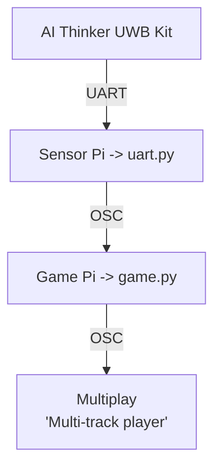

# EGL314 - POC - UWB Interactive Zone Capture Game

## Table of Contents
* [1. Project Overview](#1-project-overview)
* [2. System Architecture](#2-system-architecture-poc)
* [3. Repository Structure](#3-repository-structure-poc)
    * [3.1. assets/ ](#31-assets)
    * [3.2. docs/ ](#32-docs)
    * [3.3. module_config-files/ ](#33-module_config-files)
    * [3.4. game.py ](#34-gamepy)
    * [3.5. uart.py ](#35-uartpy)


## 1. Project Overview

An interactive multiplayer game that uses **Ai-Thinker BU03-Kit UWB modules (DW3000 + STM32F103)** for real-time player tracking.

The system consists of:
- 6 Anchors (BU03-Kit UWB modules)
- 2 Tags (BU03-Kit UWB modules)
- Sensor Pi (UWB data acquisition)
- Game Pi (game engine & visualisation)
- Multiplay (audio playback)

In the game, players must capture safe zones while avoiding moving danger zones. Visualised through `game.py` running on the Game Pi.


## 2. System Architecture (POC)



## 3. Repository Structure (POC/)

```
.
├── README.md          # this file (overview of POC/ repo)
├── POC/ 
    ├── assets/        # assets used in game developtment
    ├── docs/
        ├── assets/                    # assets used in documentation
        ├── architecture.md            # system architecture overview
        ├── calibration.md             # uwb anchor calibration guide
        ├── game_logic.md              # explaination of game.py logic
        ├── hardware_setup.md          # guide on phyiscal set-up of game
        ├── osc_reference.md           # guide to osc implementation
        ├── software_setup.md          # rpi prep and software related
        ├── troubleshooting.md         # common issues and its solution
        └── uwb_configuration.md       # BU03 board pinout
    ├── module_config-files
        ├── check_uart.sh              # confirms /dev/serial0 mapping
        ├── bu03_detect.py             # UART smoke test
        ├── bu03_multi_config.py       # set ID/role per board
        ├── bu03_inspect.py            # read back saved config
        └── viewer_calibrate.py        # per-anchor offset measurement
    ├── game.py         # main game script to run on Game Pi
    └── uart.py         # script to run on Sensor Pi to pull UART data
```

### 3.1. assets/
Contains:
- Tutorial images
- Gameplay images
- Audio assets
- UI resources


### 3.2. docs/
| **Documentation**    | **Purpose**                           |
|----------------------|---------------------------------------|
| `architecture.md`      | Explain Software pipeline             |
| `hardware_setup.md`    | Hardware setup utilised               |
| `uwb_configuration.md` | Configuration workflow                |
| `calibration.md`       | Anchor layout and calibration         |
| `software_setup.md`    | Software configuration                |
| `game_logic.md`        | Explain game itself                   |
| `osc_reference.md`     | All OSC traffic                       |
| `troubleshooting.md`   | Some possible troubles and what to do |


### 3.3. module_config-files/
These are the scripts used during deployment and setup of anchors and tags.

| **Script**           | **Purpose**                             |
|----------------------|-----------------------------------------|
| `bu03_detect.py`       | Detect connected module                 |
| `bu03_inspect.py`      | Read module information                 |
| `bu03_multi_config.py` | Configure connected module              |
| `check_uart.sh`        | Verify UART communication               |
| `viewer_calibrate.py`  | Calibration and coordinate verification |


### 3.4 game.py
This is the script that runs on the **Game Pi**.

Responsibilities of this script: 
- Receives OSC distance data
- Performs trilateration
- Applies Kalman filtering
- Handles zone detection
- Runs game state machine
- Sends OSC commands to Multiplay
- Displays GUI


### 3.5 uart.py
This is the script that runs on the **Sensor Pi**.

Responsibilities of this script:
- Reads UART data from BU03 UWB anchor that is connected to the **Sensor Pi**
- Parses distance frames
- Applies calibration offsets
- Assigns tag IDs
- Sends distance data to **Game Pi** via OSC


## Credits
Built around the Ai-Thinker BU03-Kit (DW3000 + STM32F103). Hardware datasheet and AT command reference: https://en.ai-thinker.com/pro_view-158.html.

Core Electronics BU03 Spatial Tracking Guide https://core-electronics.com.au/guides/diy-2d-and-3d-spatial-tracking-with-ultra-wideband-arduino-and-pico-guide/.