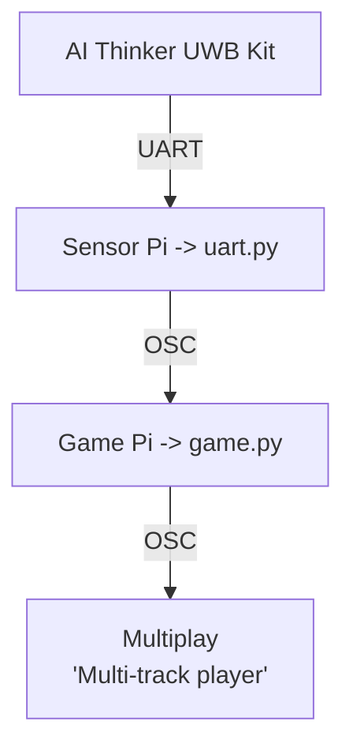

# EGL314 - Immersive Media Powered By Raspberry Pi

## Table of Contents
* [1. Repository Structure](#1-repository-structure-(EGL314_Team-A/))
    * [3.1. LoopMIDI Integration/ ](#11-LoopMIDI_Integration/)
    * [3.2. MVP/ ](#12-MVP/)
    * [3.3. OSC_files/ ](#13-OSC_files/)
    * [3.4. POC/ ](#14-POC/)
    * [3.5 Project-Development/ ](#15-Project-Development/)
* [2. Project Overview](#2-project-overview)
* [3. Core System Architecture](#3-system-architecture-poc)


## 1. Repository Structure (EGL314_Team-A/)

```
.
├── README.md          # this file (overview of repo)
├── LoopMIDI Integration/ 
├── MVP/ 
    ├── assets/        # assets used in MVP/ dir
    ├── docs/
        ├── assets/                    # assets used in documentation
        ├── architecture.md            # system architecture overview
        ├── calibration.md             # uwb anchor calibration guide
        ├── game_logic.md              # explaination of python scripts' logic/flow
        ├── hardware_setup.md          # guide on phyiscal set-up of game
        ├── osc_reference.md           # guide to osc implementation
        ├── setup_and_run.md           # guide to run game.py
        ├── software_setup.md          # rpi prep and software related
        ├── troubleshooting.md         # common issues and its solution
        └── uwb_configuration.md       # BU03 board pinout
    ├── game/          # scripts for game pi/laptop
        ├── assets/                    # assets used in game scripts
        ├── constants.py               # shared constants
        ├── game_manager.py            # main script managing game states, flows, win/loss, zone updates
        ├── game.py                    # main entry point
        ├── kalman.py                  # Smooths tag position data using a Kalman filter
        ├── level_config.py            # level specefic settings
        ├── osc_handler.py             # recivies OSC data from uart Pi to update tag position
        ├── osc_sender.py              # sends OSC cues to grandMA3 and REAPER
        ├── shared_state.py            # shared runtime states
        ├── trilateration.py           # calculates 2D tag position from anchor distance data
        ├── tutorial.py                # tutorial/instructions window 
        ├── viewer.py                  # main game display using Tkinter and Matplotlib
        └── zones.py                   # zone configs and behaviour functions
    ├── module_config-files
        ├── check_uart.sh              # confirms /dev/serial0 mapping
        ├── bu03_detect.py             # UART smoke test
        ├── bu03_multi_config.py       # set ID/role per board
        ├── bu03_inspect.py            # read back saved config
        └── viewer_calibrate.py        # per-anchor offset measurement
    └── uart.py        # script to run on Sensor Pi to pull UART data
├── OSC_files/ 
├── POC/ 
    ├── assets/        # assets used in game developtment
    ├── docs/
        ├── assets/                    # assets used in documentation
        ├── architecture.md            # system architecture overview
        ├── calibration.md             # uwb anchor calibration guide
        ├── game_logic.md              # explaination of game.py logic
        ├── hardware_setup.md          # guide on phyiscal set-up of game
        ├── osc_reference.md           # guide to osc implementation
        ├── software_setup.md          # rpi prep and software related
        ├── troubleshooting.md         # common issues and its solution
        └── uwb_configuration.md       # BU03 board pinout
    ├── module_config-files
        ├── check_uart.sh              # confirms /dev/serial0 mapping
        ├── bu03_detect.py             # UART smoke test
        ├── bu03_multi_config.py       # set ID/role per board
        ├── bu03_inspect.py            # read back saved config
        └── viewer_calibrate.py        # per-anchor offset measurement
    ├── game.py         # main game script to run on Game Pi
    └── uart.py         # script to run on Sensor Pi to pull UART data
└── Project-Development/        
```

### 3.1. LoopMIDI Integration/
This is a dir that contains a guide on how to setup LoopMIDI for REAPER to send MTC to L-ISA Controller.


### 3.2. MVP/
This is a dir that contains all the updated work that my team had accomplished up to our project's MVP stage.


### 3.3. OSC_files/
Within this dir, there are respective dirs that contain specific example osc command scripts to the corresponding softwares.


### 3.4 POC/
This is a dir that contains all the past work that my team had accomplished up to our project's POC stage.


### 3.5 Project-Development/
This is a dir where the team and I make copies of files to test certain edits. Something like a development sandbox before re-organising files into its respective dir.


## 2. Project Overview

An interactive multiplayer game that uses **Ai-Thinker BU03-Kit UWB modules (DW3000 + STM32F103)** for real-time player tracking.

The system consists of:
- 6 Anchors (BU03-Kit UWB modules)
- 2 Tags (BU03-Kit UWB modules)
- Sensor Pi (UWB data acquisition)
- Game Pi/Laptop (game engine & visualisation)
- Reaper (multi-track digital audio workstation)
- L-ISA Processor & Controller (surround sound processing)
- GrandMA3 onPC (lighting control)

In the game, players must occupy safe zones while avoiding moving danger zones. Visualised through `game.py` running on the Game Pi.


## 3. Core System Architecture



## Credits
Built around the Ai-Thinker BU03-Kit (DW3000 + STM32F103). Hardware datasheet and AT command reference: https://en.ai-thinker.com/pro_view-158.html.

Core Electronics BU03 Spatial Tracking Guide https://core-electronics.com.au/guides/diy-2d-and-3d-spatial-tracking-with-ultra-wideband-arduino-and-pico-guide/.